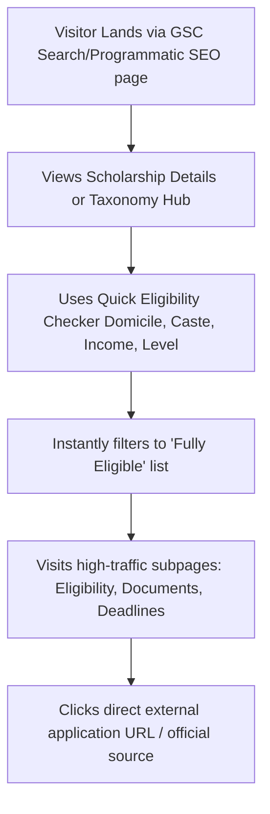

# Technical Handoff: Product & Architectural Overview
**Project Name:** IndiaScholarships (Scholarship Decision Engine)  
**Target Audience:** Senior Software Architect  
**Author:** Original System Architect  
**Date:** June 27, 2026

---

## 1. Original Vision and Purpose
The platform was conceived to resolve the massive information asymmetry and friction in the Indian educational scholarship market. 
* **The Core Problem:** Over ₹10,000 crore in student scholarship funds goes unclaimed annually in India. While there are over 1,000 government and private schemes distributing ₹50,000+ crore, students miss out due to scattered portals, complex eligibility rules, and outdated information.
* **The Solution:** An AI-assisted **Scholarship Decision Engine** that does not simply list opportunities, but tells students exactly which scholarships they are eligible for, how to apply, and lists verified data.
* **Key Differentiator:** High trust through a Date-Stamped Verification badge (e.g., "Verified for 2026") and absolute factual accuracy, preventing the common SEO trap of generic, hallucinated AI content.

---

## 2. Target Users
1. **Primary - Priya (College Student):** Gen-Z, mobile-first, from a lower-middle-class family (household income ₹0–8 Lakh/year). She searches on her phone for state/community-specific scholarships to pay her tuition and needs a fast, simple match.
2. **Secondary - Rajesh Uncle (Parent):** Tier 2/3 resident, limited technical comfort. He wants a step-by-step document checklist and printable instructions so he can verify requirements before sending his child to apply.
3. **Tertiary - School/college counselors (Mrs. Sharma):** Power user who manages scholarship guidance for hundreds of students. She wants to check eligibility in bulk and track student applications.

---

## 3. The User Journey


---

## 4. Overall Architecture
The codebase is a modern, high-performance web application optimized for search engine crawlability and near-zero infrastructure overhead.

* **Frontend Framework:** Next.js 15 (App Router) using React 18, TypeScript, and Tailwind CSS.
* **Database Layer:** SQLite (`better-sqlite3`) used as a local, embedded database. The database file (`scholarships.db`) is packed directly into the build container, eliminating external database latency.
* **Alternative Data Fetch:** A built-in WordPress REST API client wrapper allows the site to override SQLite and fetch dynamic content from a WordPress CMS backend if configured (`WORDPRESS_API_URL` environment variable). This supports hybrid setups where writers edit in WP while developers commit to GitHub.
* **Hosting Platform:** Vercel (Production URL: `https://www.indiascholarships.in`).

---

## 5. Major Folders & Responsibilities
Here is the structure of the primary Next.js application located in `Scholarship-Tracker-POC-antigravity/scholarship-app`:

```
scholarship-app/
├── app/                  # Next.js App Router (pages, components, and styling)
│   ├── api/              # API Route Handlers (eligibility matching, newsletter subscription)
│   ├── components/       # Shared UI components (Header, Footer, ScholarshipCard, etc.)
│   ├── scholarships/     # Main dynamic route /[slug] and GSC subpages /[slug]/[subpage]
│   ├── state-scholarships/ # Hub directories listing scholarships by category/caste/state
│   ├── sitemap.ts        # Dynamic XML sitemap generator
│   └── globals.css       # Global styles (Tailwind config, custom utility classes)
├── lib/                  # Backend utilities
│   ├── db.ts             # SQLite connection, schema definition, and WP mapping helpers
│   └── utils.ts          # Normalization functions, regex slugifiers, and canonical taxonomies
├── data/                 # Local data storage
│   ├── scholarships.db   # Embedded SQLite database
│   └── *.csv             # Raw CSV datasets (used as import sources)
├── scripts/              # AI Pipelines, Grounding search, and Data Ingestion tools
│   ├── import-from-sheets.js # Populates SQLite db from a synced Google Sheets CSV
│   ├── enrich-all-low-ctr-gemini.js # Gemini Grounded Research API pipeline
│   ├── content-quality-audit.js     # Frictional audit identifying gaps in database records
│   └── migrate-db.js     # DB Schema migrator for updating columns
└── package.json          # Node dependencies (better-sqlite3, googleapis, lucide-react)
```

---

## 6. Data Flows: Ingestion to Rendering
```
[Google Sheets (Writers)] 
       │ (Download CSV)
       ▼
[import-from-sheets.js] 
       │ (Parse & Insert)
       ▼
[scholarships.db (SQLite)] ──► [generateStaticParams()] ──► [Next.js Build] ──► [Static HTML on Vercel Edge]
       ▲
       │ (Auto Research & Update)
[Gemini Google Grounding Tool (API)] ◄── [content-quality-audit.js] (Finds gaps/old dates)
```

1. **Ingestion:** Writers maintain verified listings in Google Sheets. A script downloads the CSV and runs `import-from-sheets.js` to parse columns, strip year suffixes from slugs (e.g., `-2025`), and update `scholarships.db`.
2. **Auditing:** The audit tool `content-quality-audit.js` runs across the database, flagging records with old deadlines (pre-2026), missing annual amounts (displaying as "upto 0k"), or lacking FAQs.
3. **AI Enrichment:** The flagged records are fed into `enrich-all-low-ctr-gemini.js`. It queries Gemini with **Google Search Grounding** enabled to fetch current 2026-27 timelines, selection criteria, renewal policies, and helplines, saving them into the SQLite database.
4. **Rendering:** Next.js uses `generateStaticParams()` at build time to read SQLite rows and compile them into static, optimized HTML pages hosted on Vercel's edge network.

---

## 7. Routing Architecture
The application employs an aggressive Programmatic SEO routing structure to answer long-tail search queries:

* **Pillar Pages:** Static search hub directories such as `/state-scholarships` or `/scholarships-by-category`.
* **Detail Pages:** `/scholarships/[slug]` displays the comprehensive breakdown of a specific scheme.
* **Subpages:** `/scholarships/[slug]/[subpage]` where `[subpage]` is one of:
  * `eligibility` (Matches: *"Who is eligible for X scholarship?"*)
  * `income-limit` (Matches: *"What is the family income limit for X scholarship?"*)
  * `documents-required` (Matches: *"Documents needed to apply for X scholarship"*)
  * `last-date` (Matches: *"What is the deadline for X scholarship?"*)
  * `selection-process` (Matches: *"Selection criteria for X scholarship"*)
  * `apply-online` (Matches: *"How to register online for X scholarship"*)
  * `renewal-process` (Matches: *"Renewal process for X scholarship"*)
* **Taxonomy Hubs:** 
  * `/scholarships-in/[state]` (e.g., `/scholarships-in/karnataka`)
  * `/scholarships-for/[category]` (e.g., `/scholarships-for-obc`)
  * `/scholarships-level/[level]` (e.g., `/scholarships-level/graduation-ug`)
  * `/scholarships-income/[income-slug]` (e.g., `/scholarships-income/2.5-5l`)
  * `/scholarships-by-course/[course]` (e.g., `/scholarships-by-course/engineering`)

---

## 8. Rendering Strategy
* **Static Site Generation (SSG):** All dynamic paths (states, levels, categories, detail pages, and subpages) export `generateStaticParams()`. During `npm run build`, Next.js compiles every possible route into static HTML.
* **Incremental Static Regeneration (ISR):** For setups integrated with the WordPress API, fetch calls utilize `next: { revalidate: 3600 }`. If a content writer modifies a post, Vercel updates the static cache on-demand within an hour without requiring a full code rebuild.
* **Edge Caching:** Static assets and pages are distributed worldwide on Vercel's Edge network, securing sub-100ms load times for Tier-3 mobile searchers.

---

## 9. Reusable vs. Scholarship-Specific Parts
* **Reusable Platform Parts:**
  * The natural language filtering logic and eligibility matching algorithm (`HomeClient.tsx`).
  * The generic SEO metadata and structured JSON-LD schema builder.
  * The dynamic XML sitemap compiler (`sitemap.ts`).
  * The local SQLite data access hooks and SQLite WAL (Write-Ahead Logging) configuration.
* **Scholarship-Specific Parts:**
  * Complex caste classification mapping (SC, ST, OBC, EWS, Brahmin, Minorities) in `lib/utils.ts`.
  * Specialized document checklists parsing logic (`docs_needed` arrays containing Aadhaar, income, domicile certificates).
  * Unique state resident rules and income threshold buckets.

---

## 10. Major Architectural Rationale
1. **SQLite over PostgreSQL/MySQL:** For read-heavy directory sites, Postgres adds unnecessary network overhead, configuration, and costs. Storing a local, optimized SQLite file right inside the Next.js bundle is fast, free, and simplifies deployments.
2. **WordPress Fallback Layer:** Allows non-technical content writers to use a familiar interface while keeping the Next.js frontend code clean and independent.
3. **No Database Writes in production:** The database is strictly read-only on the frontend. Subscriptions and user feedback are routed through lightweight API endpoints (such as Google Sheets integration), keeping the core Next.js application stateless.
4. **URL slug stripping of years:** Year suffix removal prevents 404 redirects and search ranking losses when scholarships transition from `2025` to `2026`.

---

## 11. Unfinished Ideas & Future Roadmap
* **Automated Cron Grounding:** Setting up a GitHub Actions workflow to run the Gemini enrichment pipeline weekly, keeping deadlines and application portals verified with zero developer intervention.
* **B2B School Counselor Dashboard:** Allowing schools to import student Excel sheets and instantly output a PDF matrix mapping each student to 5 matched scholarships.
* **Platform White-labeling:** Redesigning the directories to load database records dynamically based on the current hostname, allowing the same codebase to host `indiascholarships.in`, `indiacollegeranker.in`, and `indiagovschemes.in`.

---

## 12. Onboarding Guide for a New Architect
If you are taking over this codebase, understand these rules before modifying the architecture:
1. **Preserve Slug Invariant:** Never let year numbers creep back into database slugs. Slugs must remain static across years (e.g., `/scholarships/sitaram-jindal-foundation-scholarship` instead of `/sitaram-jindal-2025`).
2. **Check the SQLite WAL mode:** If you replace SQLite queries, ensure the database is initialized with `db.pragma('journal_mode = WAL')` to support concurrent read operations.
3. **Keep the database bundle size small:** SQLite database size must be monitored. Compress text fields and store rich assets (thumbnails) externally (e.g., on Cloudinary or Vercel Blob).
4. **Do not add arbitrary stateful API calls:** Keep the system fully cacheable on Vercel's edge. Any user authentication or tracking must be decoupled using client-side React islands or third-party auth services.

---

## 13. Product Manager (PM) Context: Strategic & Conversion Goals

### Why We Decoupled CMS and Code
From a product operations perspective, the biggest bottleneck in content-heavy sites is the "developer queue" (e.g., writers waiting for code pushes to change a typo or deadline date, or developers being distracted by content edits). By setting up a headless WordPress API config, we decoupled these two workflows:
* **The Content Team** operates with complete autonomy inside a familiar, easy-to-use CMS without ever seeing code.
* **The Engineering Team** focuses on routing, performance optimization, and layout adjustments without touching data entries.
* **Launch Velocity:** Setting up WordPress + ACF allowed us to launch a highly structured directory backend in hours instead of writing custom admin dashboards from scratch.

### User Value Proposition & Conversion Drivers
Every page layout decision was made to maximize conversion and user trust:
* **Mobile Sticky CTA:** Over 70% of our student users search on mobile. A sticky floating action button at the bottom of the viewport ensures that they can easily take action (apply or check eligibility) at any point while scrolling through long requirement text.
* **Transactional Prefilling:** The eligibility checker prefills inputs directly from URL parameters. This reduces onboarding friction, making the match process feel "instant" when students click from state/category-specific organic search listings.
* **Trust & Retention Fallbacks:** Static HTML fallback via SQLite is a traffic safeguard. If WordPress crashes or response latency spikes, the live user experience is unaffected, preventing high bounce rates and protecting search authority.

