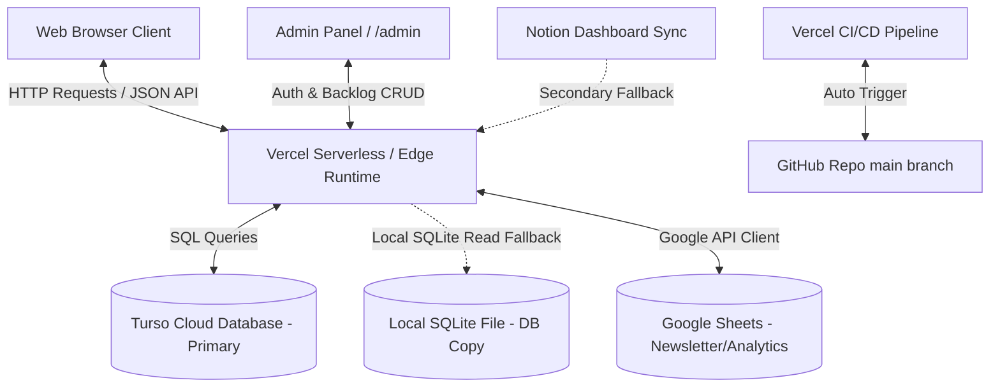
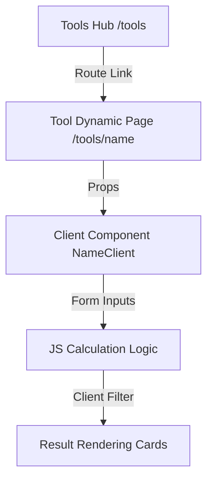
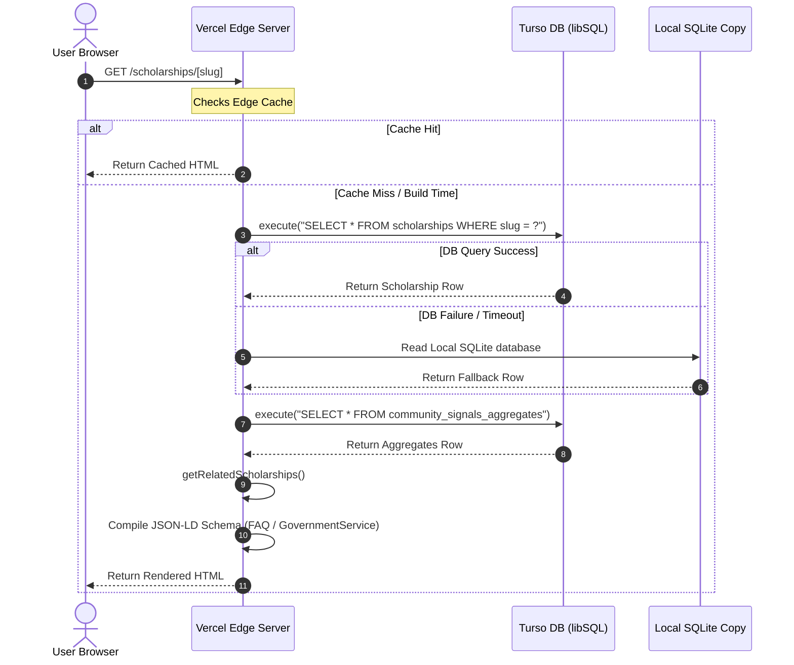
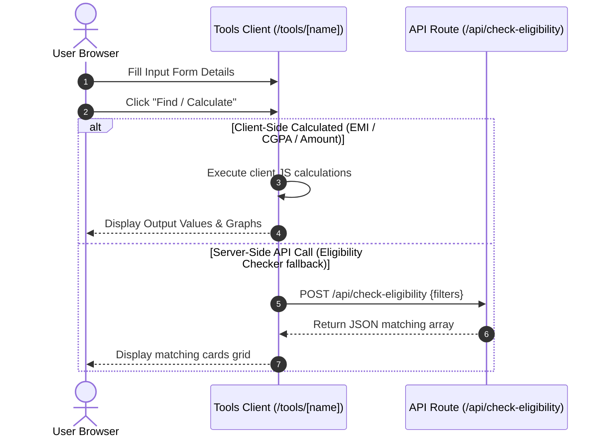
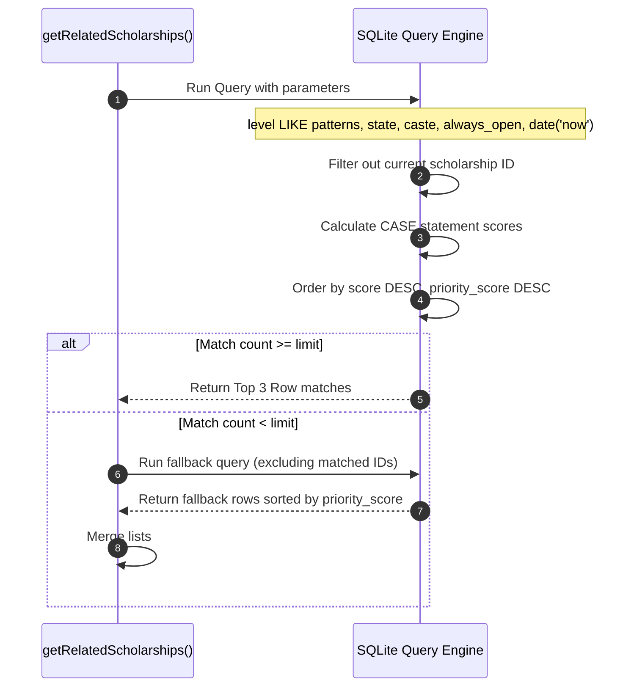
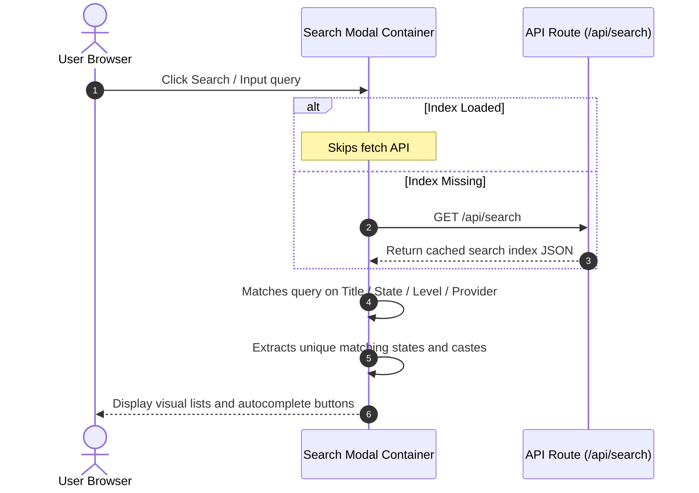
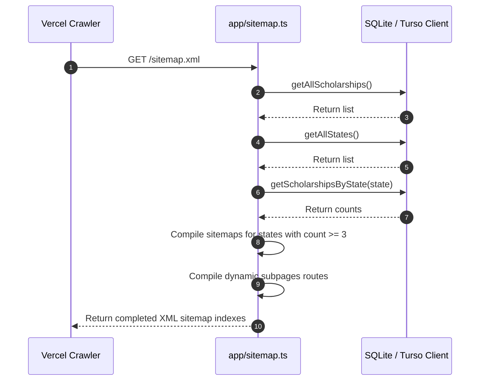
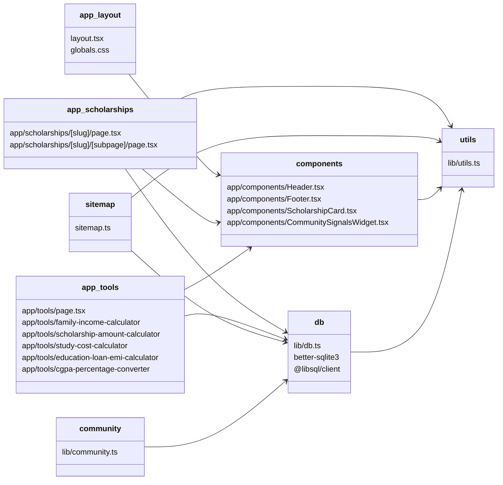

# Architecture Context Document: IndiaScholarships.in
**Document Version:** 1.0.0  
**Target Audience:** Senior Product Managers, Tech Leads, and Engineering Onboarding  
**Current Production Cycle:** July 2026

---

## 1. High-Level Architecture

IndiaScholarships.in is built as a high-performance programmatic SEO platform designed to catalog, filter, and serve verified scholarship schemes to Indian students. The site optimizes for mobile loading speeds, SEO indexation, and local-first data reliability.



### Core Architecture Specifications
*   **Framework**: Next.js 15.5.9 (utilizing React 18.3.1, TypeScript 5, and App Router for folder-based routing layout).
*   **Routing Architecture**: Folder-based Next.js App Router. Subpages are generated using dynamic path parameters (`[slug]`, `[state]`, `[subpage]`).
*   **Rendering Strategy**:
    *   **SSG (Static Site Generation)**: Used for all main scholarship detail pages (`/scholarships/[slug]`) and subpages (`/scholarships/[slug]/[subpage]`) using `generateStaticParams`. This compiles HTML at build time, optimizing for fast LCP (Largest Contentful Paint) and Core Web Vitals.
    *   **Dynamic Server Rendering (SSR)**: Used for calculators and listing filters to ensure real-time matching.
    *   **Redirects**: Static redirections (e.g. Broken Search Route redirecting to `/scholarships`, legacy state route formats mapping `/state/:state` to `/scholarships-in/:state`, and provider mappings) are compiled statically within `next.config.ts`.
*   **Deployment**: Hosted on **Vercel** with continuous deployment triggered by commits to the `main` branch of the GitHub repository (`https://github.com/bizmantra/india-scholarships.git`).
*   **Database**:
    *   **Production**: Turso Cloud DB (SQL-based libSQL database) serves as the primary live runtime database, accessed using `@libsql/client`.
    *   **Local / Build Fallback**: A local SQLite file (`data/scholarships.db`) is checked directly into the git repository. When the production database has query or latency issues, or during offline local rendering, it falls back to this file (`file:data/scholarships.db`).
*   **Search**: Fully client-side matching. The application compiles a lightweight search index of all active opportunities via `/api/search` and caches it on the edge. The `SearchModal` fetches this index once on open and performs local Javascript character-sequence filters.
*   **APIs**: Next.js serverless route handlers (`app/api/`) handle search indexes, dynamic eligibility POST requests, subscription registrations, and community event submissions.
*   **State Management**: Standard React hooks (`useState`, `useMemo`, `useEffect`) manage localized component state. Filter selections are synchronized and pre-populated using Next.js `useSearchParams` URL parameter routing. Cookies manage rates limits (`community_session_id`) and admin authorization.
*   **Caching**: Caching headers are set at the edge via Next.js response headers. The search API utilizes `Cache-Control: public, s-maxage=3600, stale-while-revalidate=600` to prevent database read spikes.
*   **Images**: Optimized using the Next.js `Image` component (`next/image`) for WebP support, sizing, and lazy loading.
*   **SEO Architecture**: Programmatic page compilation, automated canonical URL injection, dynamic schema metadata rendering (FAQPage and GovernmentService), and static sitemap compilation.

---

## 2. Folder Structure

The repository is organized to decouple layout configurations, client-side interactions, database routines, and static backlogs.

```
/
├── app/                              # Next.js App Router (Routing Root)
│   ├── [locale]/                     # Deactivated translation folders/routes
│   ├── api/                          # Serverless Endpoint API Routes
│   │   ├── admin/                    # Admin auth and moderation handlers
│   │   ├── check-eligibility/        # POST matching criteria endpoint
│   │   ├── community-events/         # User reported updates & analytics
│   │   ├── search/                   # Cachable search index query endpoint
│   │   └── subscribe/                # Google Sheets registration API
│   ├── components/                   # Reusable UI components & Widgets
│   ├── scholarships/                 # Main dynamic detail pages and deadlines
│   ├── scholarships-in/              # Dynamic state listing hubs
│   ├── tools/                        # Interactive tools and calculators
│   ├── layout.tsx                    # Root HTML envelope, GA, and AdSense
│   └── sitemap.ts                    # Dynamic sitemap index generator
├── data/                             # Local SQLite DB, Backlogs, & Reports
│   ├── backlog-dev.json / .md        # Development tasks (Source & Mirror)
│   ├── backlog-content.json / .md    # Content expansion tasks (Source & Mirror)
│   ├── scholarships.db               # Local SQLite database file
│   └── content-quality-report.md     # Audit validation logs
├── lib/                              # Shared backend core files
│   ├── community.ts                  # Aggregation engine for user signals
│   ├── db.ts                         # libSQL Client wrapper & SQLite queries
│   ├── google-sheets.js              # Google Sheets API connection helper
│   └── utils.ts                      # Parsers, Slugifiers, & formatters
├── public/                           # Public assets, icons, logo-is.png
├── scripts/                          # DB migrations, scrapers, & cron tools
│   ├── push-to-turso.js              # SQLite -> Turso syncing utility
│   ├── content-quality-audit.js      # QA validation rule checker
│   └── update-notion-dashboard.js    # Markdown dashboard compiler
└── types/                            # Global TypeScript types (scholarship.ts)
```

---

## 3. Scholarship Data Model

This model maps SQLite database columns directly to the internal `ScholarshipData` type definitions:

### `id`
*   **Type**: `TEXT` (UUID or numeric ID string)
*   **Source**: Migrated from WordPress REST ID or custom database seed script.
*   **Required**: Yes
*   **Used where**: Detail page queries, related matching exclusions, community signals tracking.
*   **Indexed**: Yes (Primary Key)
*   **Searchable**: No
*   **Available to tools**: Yes

### `title`
*   **Type**: `TEXT`
*   **Source**: WordPress Title or scraper database input.
*   **Required**: Yes
*   **Used where**: Page titles, cards, search results, SEO meta, schema markup.
*   **Indexed**: No
*   **Searchable**: Yes
*   **Available to tools**: Yes

### `slug`
*   **Type**: `TEXT`
*   **Source**: Clean URL-safe title mapping (e.g. `sitaram-jindal-foundation-scholarship`).
*   **Required**: Yes
*   **Used where**: Dynamic page routing, sitemaps, canonical configurations.
*   **Indexed**: Yes (Unique Constraint)
*   **Searchable**: No
*   **Available to tools**: Yes

### `provider`
*   **Type**: `TEXT`
*   **Source**: Organization/authority offering the scholarship.
*   **Required**: No (Falls back to empty string)
*   **Used where**: Metadata description, cards, search filters.
*   **Indexed**: No
*   **Searchable**: Yes
*   **Available to tools**: Yes

### `provider_type`
*   **Type**: `TEXT` (Standardized: `'Government' | 'Corporate' | 'University' | 'Trust' | 'Private'`)
*   **Source**: ACF select choices.
*   **Required**: Yes
*   **Used where**: Taxonomy matching, provider pillar routing (`getScholarshipTypeRoute`).
*   **Indexed**: No
*   **Searchable**: No
*   **Available to tools**: Yes

### `state`
*   **Type**: `TEXT` (Standardized state names or `'All India'`)
*   **Source**: Domicile state criteria.
*   **Required**: Yes
*   **Used where**: State hub routing (`/scholarships-in/[state]`), eligibility filters.
*   **Indexed**: Yes
*   **Searchable**: Yes
*   **Available to tools**: Yes

### `level`
*   **Type**: `TEXT` (Checkboxed JSON array or raw string mapping)
*   **Source**: Standardized academic levels (e.g. `['Class 1-10', 'Graduation (UG)']`).
*   **Required**: Yes
*   **Used where**: Level listings, eligibility checking, related card matching.
*   **Indexed**: No
*   **Searchable**: Yes
*   **Available to tools**: Yes

### `caste`
*   **Type**: `TEXT` (JSON array of category tags)
*   **Source**: Category eligibility arrays (e.g. `['SC', 'ST', 'OBC', 'General']`).
*   **Required**: Yes
*   **Used where**: Category hubs, eligibility checker inputs, related matching.
*   **Indexed**: No
*   **Searchable**: Yes
*   **Available to tools**: Yes

### `gender`
*   **Type**: `TEXT` (Standardized: `'All' | 'Female Only' | 'Male Only'`)
*   **Source**: Gender limit rules.
*   **Required**: Yes
*   **Used where**: Eligibility checker, facts panel.
*   **Indexed**: No
*   **Searchable**: No
*   **Available to tools**: Yes

### `course_stream`
*   **Type**: `TEXT` (JSON array of strings)
*   **Source**: Academic stream parameters (e.g. `['Engineering', 'Medical']`).
*   **Required**: No
*   **Used where**: Course-specific filters, amount calculations.
*   **Indexed**: No
*   **Searchable**: Yes
*   **Available to tools**: Yes

### `amount_annual`
*   **Type**: `INTEGER` (Maximum annual financial benefit in INR)
*   **Source**: Financial tiers.
*   **Required**: Yes (Values of `0` or `null` trigger critical QA warnings)
*   **Used where**: Details payout highlight, card amounts, sitemaps.
*   **Indexed**: No (Implicitly sorted)
*   **Searchable**: No
*   **Available to tools**: Yes

### `amount_min`
*   **Type**: `INTEGER`
*   **Source**: Base annual benefit in INR.
*   **Required**: No
*   **Used where**: Fallback amount rendering chain when `amount_annual` is empty.
*   **Indexed**: No
*   **Searchable**: No
*   **Available to tools**: Yes

### `amount_description`
*   **Type**: `TEXT`
*   **Source**: Visual textual breakdown of payout.
*   **Required**: No
*   **Used where**: Facts block, scholarship listing cards.
*   **Indexed**: No
*   **Searchable**: No
*   **Available to tools**: Yes

### `benefits`
*   **Type**: `TEXT` (RichText / HTML)
*   **Source**: Detailed description of non-financial or visual payout components.
*   **Required**: No
*   **Used where**: Detail page benefits column, dynamic subpage panels.
*   **Indexed**: No
*   **Searchable**: No
*   **Available to tools**: Yes

### `income_limit`
*   **Type**: `INTEGER` (Maximum allowed annual family income cap in INR)
*   **Source**: Income certificate validation bounds.
*   **Required**: Yes (Falls back to `0` or `null` representing "No Income Bar")
*   **Used where**: Eligibility checker, income limit hub, family income calculator.
*   **Indexed**: No
*   **Searchable**: No
*   **Available to tools**: Yes

### `min_marks`
*   **Type**: `INTEGER` (Minimum percentage needed in previous year, e.g. `50`)
*   **Source**: Academic criteria.
*   **Required**: Yes
*   **Used where**: Eligibility checker validation.
*   **Indexed**: No
*   **Searchable**: No
*   **Available to tools**: Yes

### `age_limit`
*   **Type**: `TEXT`
*   **Source**: Maximum age threshold.
*   **Required**: No (Defaults to `'NA'`)
*   **Used where**: Quick facts, eligibility columns.
*   **Indexed**: No
*   **Searchable**: No
*   **Available to tools**: Yes

### `residency_requirement`
*   **Type**: `TEXT`
*   **Source**: Domicile restrictions.
*   **Required**: No
*   **Used where**: Government service schemas, detail pages.
*   **Indexed**: No
*   **Searchable**: No
*   **Available to tools**: Yes

### `docs_needed`
*   **Type**: `TEXT` (Parsed comma/newline lists)
*   **Source**: Standard documentation lists.
*   **Required**: Yes
*   **Used where**: Documents subpage checklists.
*   **Indexed**: No
*   **Searchable**: No
*   **Available to tools**: Yes

### `application_mode`
*   **Type**: `TEXT` (Standardized: `'Online' | 'Offline'`)
*   **Source**: Submission delivery style.
*   **Required**: Yes
*   **Used where**: Details dashboard.
*   **Indexed**: No
*   **Searchable**: No
*   **Available to tools**: Yes

### `apply_url`
*   **Type**: `TEXT`
*   **Source**: Official application portal URL.
*   **Required**: Yes
*   **Used where**: Application buttons (sanitized via `sanitizeApplyUrl`).
*   **Indexed**: No
*   **Searchable**: No
*   **Available to tools**: Yes

### `deadline`
*   **Type**: `TEXT` (Date string format: `YYYY-MM-DD` or descriptions)
*   **Source**: Current active intake deadline.
*   **Required**: Yes
*   **Used where**: Sorting closing soon cards, deadline calendar list.
*   **Indexed**: No
*   **Searchable**: No
*   **Available to tools**: Yes

### `deadline_description`
*   **Type**: `TEXT`
*   **Source**: Notes on deadline schedules (e.g. `'Tentative'`).
*   **Required**: No
*   **Used where**: Cards, timeline rows.
*   **Indexed**: No
*   **Searchable**: No
*   **Available to tools**: Yes

### `time_min`
*   **Type**: `INTEGER`
*   **Source**: Application complexity estimate in minutes.
*   **Required**: No
*   **Used where**: Facts header.
*   **Indexed**: No
*   **Searchable**: No
*   **Available to tools**: Yes

### `step_guide`
*   **Type**: `TEXT` (RichText / HTML)
*   **Source**: Step-by-step submission steps.
*   **Required**: No
*   **Used where**: Apply-online subpage routes.
*   **Indexed**: No
*   **Searchable**: No
*   **Available to tools**: Yes

### `selection`
*   **Type**: `TEXT` (RichText / HTML)
*   **Source**: Candidate filtering methodology details.
*   **Required**: No
*   **Used where**: Selection-process subpages.
*   **Indexed**: No
*   **Searchable**: No
*   **Available to tools**: Yes

### `total_awards`
*   **Type**: `INTEGER`
*   **Source**: Total scholarships distributed annually.
*   **Required**: No
*   **Used where**: Facts columns.
*   **Indexed**: No
*   **Searchable**: No
*   **Available to tools**: Yes

### `renewal`
*   **Type**: `TEXT` (RichText / HTML)
*   **Source**: Criteria to maintain eligibility for subsequent years.
*   **Required**: No
*   **Used where**: Renewal-process subpage layouts.
*   **Indexed**: No
*   **Searchable**: No
*   **Available to tools**: Yes

### `competitiveness`
*   **Type**: `TEXT`
*   **Source**: Calculated competition score.
*   **Required**: No
*   **Used where**: Details panels.
*   **Indexed**: No
*   **Searchable**: No
*   **Available to tools**: Yes

### `verified_status`
*   **Type**: `TEXT`
*   **Source**: Verification state badge (`'Verified' | 'Pending'`).
*   **Required**: Yes
*   **Used where**: Verification shield badges on headers.
*   **Indexed**: No
*   **Searchable**: No
*   **Available to tools**: Yes

### `last_verified`
*   **Type**: `TEXT`
*   **Source**: Audit validation timestamp.
*   **Required**: Yes
*   **Used where**: Facts rows, verification headers.
*   **Indexed**: No
*   **Searchable**: No
*   **Available to tools**: Yes

### `official_source`
*   **Type**: `TEXT`
*   **Source**: Official organization home domain.
*   **Required**: Yes
*   **Used where**: Application link fallback, schemas.
*   **Indexed**: No
*   **Searchable**: No
*   **Available to tools**: Yes

### `helpline`
*   **Type**: `TEXT`
*   **Source**: Phone numbers, emails, addresses.
*   **Required**: Yes
*   **Used where**: Contacts widgets on details.
*   **Indexed**: No
*   **Searchable**: No
*   **Available to tools**: Yes

### `intro_seo`
*   **Type**: `TEXT` (RichText / HTML)
*   **Source**: Program summary paragraph.
*   **Required**: Yes
*   **Used where**: Top of details, custom meta description fallbacks.
*   **Indexed**: No
*   **Searchable**: No
*   **Available to tools**: Yes

### `faq_json`
*   **Type**: `TEXT` (JSON array of `{question: string, answer: string}`)
*   **Source**: Common queries.
*   **Required**: Yes
*   **Used where**: Details FAQ sections, dynamic subpages, FAQPage schema.
*   **Indexed**: No
*   **Searchable**: No
*   **Available to tools**: Yes

### `notes_actions`
*   **Type**: `TEXT`
*   **Source**: Internal database editing logs.
*   **Required**: No
*   **Used where**: Admin backlog tracking.
*   **Indexed**: No
*   **Searchable**: No
*   **Available to tools**: No

### `keywords`
*   **Type**: `TEXT`
*   **Source**: Extended search strings.
*   **Required**: No
*   **Used where**: General keywords lookup.
*   **Indexed**: No
*   **Searchable**: Yes
*   **Available to tools**: Yes

### `scholarship_type`
*   **Type**: `TEXT` (Standardized: `'Government' | 'Study Abroad' | 'Private'`)
*   **Source**: Provider type selector.
*   **Required**: Yes
*   **Used where**: General category routes.
*   **Indexed**: No
*   **Searchable**: No
*   **Available to tools**: Yes

### `status`
*   **Type**: `TEXT` (Standardized: `'Active' | 'Closed'`)
*   **Source**: Intake availability.
*   **Required**: Yes
*   **Used where**: General dynamic page filtering.
*   **Indexed**: Yes
*   **Searchable**: No
*   **Available to tools**: Yes

### `verification_year`
*   **Type**: `INTEGER` (Dynamic cycle year, e.g. `2026`)
*   **Source**: Audit script target.
*   **Required**: Yes
*   **Used where**: Page titles, SEO, OpenGraph tags.
*   **Indexed**: No
*   **Searchable**: No
*   **Available to tools**: Yes

### `show_on_homepage`
*   **Type**: `INTEGER` (`0 | 1`)
*   **Source**: Home display flag.
*   **Required**: Yes
*   **Used where**: Homepage query.
*   **Indexed**: No
*   **Searchable**: No
*   **Available to tools**: Yes

### `is_featured`
*   **Type**: `INTEGER` (`0 | 1`)
*   **Source**: Payout value / impact flag.
*   **Required**: Yes
*   **Used where**: Homepage features slider, pillar search lists.
*   **Indexed**: No
*   **Searchable**: No
*   **Available to tools**: Yes

### `is_popular`
*   **Type**: `INTEGER` (`0 | 1`)
*   **Source**: CTR popularity flag.
*   **Required**: Yes
*   **Used where**: Trending lists.
*   **Indexed**: No
*   **Searchable**: No
*   **Available to tools**: Yes

### `priority_score`
*   **Type**: `INTEGER` (Order rating, higher = prioritized)
*   **Source**: Calculated database priority.
*   **Required**: Yes
*   **Used where**: Related fallbacks ordering, listing sorts.
*   **Indexed**: Yes
*   **Searchable**: No
*   **Available to tools**: Yes

### `special_conditions`
*   **Type**: `TEXT`
*   **Source**: Custom exclusion rules.
*   **Required**: No
*   **Used where**: Detail page caveats, university matching.
*   **Indexed**: No
*   **Searchable**: No
*   **Available to tools**: Yes

### `tags`
*   **Type**: `TEXT` (JSON array of strings)
*   **Source**: General keyword tags.
*   **Required**: No
*   **Used where**: Search results matching, tags block.
*   **Indexed**: No
*   **Searchable**: Yes
*   **Available to tools**: Yes

### `thumbnail_url`
*   **Type**: `TEXT`
*   **Source**: Scheme logo URL.
*   **Required**: No
*   **Used where**: Cards, details header.
*   **Indexed**: No
*   **Searchable**: No
*   **Available to tools**: Yes

### `created_at`
*   **Type**: `TEXT`
*   **Source**: Database entry creation timestamp.
*   **Required**: Yes
*   **Used where**: Sorting recently added lists.
*   **Indexed**: Yes
*   **Searchable**: No
*   **Available to tools**: Yes

### `scholarship_scope`
*   **Type**: `TEXT` (Standardized: `'Domestic' | 'International'`)
*   **Source**: Destination study scope.
*   **Required**: Yes
*   **Used where**: Sitemap filters, International hub.
*   **Indexed**: Yes
*   **Searchable**: No
*   **Available to tools**: Yes

### `country_of_study`
*   **Type**: `TEXT` (e.g. `'Germany' | 'Any Country'`)
*   **Source**: International criteria.
*   **Required**: No
*   **Used where**: Study abroad detail lists, dynamic level x country sitemaps.
*   **Indexed**: No
*   **Searchable**: Yes
*   **Available to tools**: Yes

### `always_open`
*   **Type**: `INTEGER` (`0 | 1`)
*   **Source**: No hard close date flag.
*   **Required**: Yes
*   **Used where**: Deadlines, related recommendations checks.
*   **Indexed**: No
*   **Searchable**: No
*   **Available to tools**: Yes

---

## 4. Tool Architecture

IndiaScholarships.in implements 6 active tools/calculators, with 2 currently in "Coming Soon" states. All tools are built with a server-side route wrapper supplying database records to a client-side calculator logic container.



### 1. Scholarship Eligibility Checker
*   **Route**: `/eligibility-checker` (Also linked under `/tools/scholarship-eligibility-checker` which routes to the same UI)
*   **Components**: `EligibilityClient`
*   **Shared Components**: `Header`, `Footer`, `ScholarshipCard`, `ShareButtons`
*   **Data Source**: Dynamic load from `getAllScholarships()` passed down from server parent wrapper.
*   **Filtering Logic**: Iterates over all active scholarships:
    *   State: Matches if `s.state === selectedState` OR `s.state === 'All India'` OR `s.state === 'NA'`.
    *   Income: Matches if `!s.income_limit` OR `s.income_limit >= studentAnnualIncome`.
    *   Marks: Matches if `!s.min_marks` OR `s.min_marks <= studentPreviousMarks`.
    *   Level: Matches if `s.level` matches input level or mapped strings (e.g. `UG` matches `Undergraduate`).
    *   Caste: Matches if `s.caste` includes selected category OR `s.caste` includes `'All'` OR array is empty.
*   **Recommendation Logic**: Sorted by annual benefit amount descending.
*   **Result Rendering**: Responsive card grid of matching opportunities, displaying total potential value and sharing widget.
*   **Existing Schemas**: None (Basic header meta).
*   **Existing Analytics**: None (Standard page view).
*   **Existing SEO**: Canonical canonical mapping `/eligibility-checker`.

### 2. Family Income Calculator
*   **Route**: `/tools/family-income-calculator`
*   **Components**: `IncomeClient`
*   **Shared Components**: `Header`, `Footer`, `ScholarshipCard`
*   **Data Source**: Active scholarships array.
*   **Filtering Logic**: Iterates match check: `s.income_limit === 0 || income <= s.income_limit`.
*   **Recommendation Logic**: Groups matching schemes into three tabs: `government` (provider type contains government), `international` (scope is international or amount is high), and `private` (default).
*   **Result Rendering**: Preset click targets (`1.5L`, `2.5L`, `4.5L`, `6L`, `8L`) or slider input. Tabbed cards with total matches counter.
*   **Existing Schemas**: Custom `FAQPage` schema injected into page HTML detailing income limits.
*   **Existing Analytics**: None.
*   **Existing SEO**: Page meta titles including dynamic year variables.

### 3. Scholarship Amount Calculator
*   **Route**: `/tools/scholarship-amount-calculator`
*   **Components**: `AmountClient`
*   **Shared Components**: `Header`, `Footer`, `ScholarshipCard`
*   **Data Source**: Active scholarships data.
*   **Filtering Logic**: Evaluates matching schemes based on academic level, category, and course stream parameters.
*   **Recommendation Logic**: Iterates over matching entries to calculate:
    *   Minimum value: `Math.min(...amounts)`
    *   Maximum value: `Math.max(...amounts)`
    *   Average value: `Math.round(sum / count)`
*   **Result Rendering**: Stats grid displaying min, max, and average annual estimated payouts. Displays matching listings below.
*   **Existing Schemas**: Custom `FAQPage` schema about payout expectations.
*   **Existing Analytics**: None.
*   **Existing SEO**: Direct page title overrides.

### 4. Study Cost Calculator
*   **Route**: `/tools/study-cost-calculator`
*   **Components**: `CostClient`
*   **Shared Components**: `Header`, `Footer`, `ScholarshipCard`
*   **Data Source**: Active scholarships list.
*   **Filtering Logic**:
    *   Calculates: `Total Cost = tuition + (accommodation * 12) + (food * 12) + books`
    *   Calculates: `Funding Gap = Total Cost - securedScholarship`
    *   Calculates: `Coverage % = (securedScholarship / Total Cost) * 100`
*   **Recommendation Logic**: Pulls scholarships matching student's level and category that can potentially cover the funding deficit.
*   **Result Rendering**: Visual circular progress bar of coverage, funding breakdown table, deficit banner, and matching options list.
*   **Existing Schemas**: Dynamic schema metadata.
*   **Existing Analytics**: None.
*   **Existing SEO**: Custom meta tags.

### 5. Education Loan EMI Calculator
*   **Route**: `/tools/education-loan-emi-calculator`
*   **Components**: `EmiClient`
*   **Shared Components**: `Header`, `Footer`
*   **Data Source**: Client-side math formulas (static, no DB call).
*   **Filtering Logic**: Calculates loan interest accumulated during moratorium (course duration + 1 year grace):
    *   Without subsidy, compounded: `P_adj = Principal * (1 + r)^mor_months`
    *   Without subsidy, simple: `P_adj = Principal + (Principal * r * mor_years)`
    *   With subsidy (interest paid by govt): `P_adj = Principal`
    *   Monthly EMI calculated: `EMI = P_adj * r * (1 + r)^n / ((1 + r)^n - 1)`
*   **Recommendation Logic**: None (Self-contained calculation).
*   **Result Rendering**: Payout schedule, amortization chart details, monthly repayment value banner, and total interest payable sum.
*   **Existing Schemas**: Dynamic schema.
*   **Existing Analytics**: None.
*   **Existing SEO**: Custom meta title tags.

### 6. CGPA to Percentage Converter
*   **Route**: `/tools/cgpa-percentage-converter`
*   **Components**: `CgpaClient`
*   **Shared Components**: `Header`, `Footer`
*   **Data Source**: Client-side conversion.
*   **Filtering Logic**:
    *   10-point scale (multiplier 9.5): `Percentage = CGPA * 9.5`
    *   10-point scale (multiplier 10.0): `Percentage = CGPA * 10.0`
    *   4-point scale: `Percentage = (GPA / 4) * 100`
*   **Recommendation Logic**: None.
*   **Result Rendering**: Large conversion score display (e.g. `71.25%`), simple conversion steps breakdown, and CBSET/AICTE formula instructions.
*   **Existing Schemas**: Custom FAQPage schema.
*   **Existing Analytics**: None.
*   **Existing SEO**: Static meta titles.

---

## 5. Reusable Components

All reusable components are located in `app/components/` and are built using React and Lucide React icons.

### `Header`
*   **Used by**: Homepage (`app/page.tsx`), listing pages, all tools, all detail/subpages.
*   **Purpose**: Renders the persistent navigation bar. Includes sticky blurring, mobile menu toggles, and dropdown links. Search and language triggers are temporarily disabled.

### `Footer`
*   **Used by**: Homepage, listing directories, tools directory, guides directory.
*   **Purpose**: Standard layout footer. Renders site map links, privacy policies, copyright lines, and active link to Telegram community channel.

### `ScholarshipCard`
*   **Used by**: Detail templates, state list pages, search results, eligibility checker, tools.
*   **Purpose**: Visual card container. Displays scholarship title, provider name, annual amount, domicile state, deadline dates, and links to target routes. Implements safe fallback date parsers to avoid "Invalid Date" strings. Supports list and grid layouts.

### `SearchResultsHeader`
*   **Used by**: List filter pages.
*   **Purpose**: Displays matches counter and allows sorting selections.

### `FilterChips`
*   **Used by**: Listings directories.
*   **Purpose**: Visual buttons displaying active category/state filter selections.

### `SearchModal`
*   **Used by**: Header (disabled).
*   **Purpose**: Dialog overlay for character-matching queries, allowing arrow-key keyboard navigation and autocomplete.

### `ShareButtons`
*   **Used by**: Detail templates, eligibility checkers.
*   **Purpose**: Share buttons for WhatsApp, Telegram, Twitter/X, and clipboard links copy.

### `LanguageDetector`
*   **Used by**: Main detail pages.
*   **Purpose**: Detects device language preferences.

### `LanguageSwitcher`
*   **Used by**: Header (disabled).
*   **Purpose**: Locale switching dropdown panel.

### `SubscribeForm`
*   **Used by**: Bypassed pages (removed from detail templates).
*   **Purpose**: Basic email capture form.

### `CommunitySignalsWidget`
*   **Used by**: Detail pages (`app/scholarships/[slug]/page.tsx`).
*   **Purpose**: Core user feedback interactive panel. Queries pre-computed community signals aggregates, displays stats (verifications, selection rates, average payments), handles Turnstile-protected POST updates, and manages 24h session cookies rate limiting.

---

## 6. Layout System

The platform adopts a wrapper-based layout strategy without nesting layout files to maximize rendering performance.

```
RootLayout (app/layout.tsx)
└── Page Template Layout (app/[route]/page.tsx)
    ├── Header
    ├── Page Main Container
    │   ├── Left Column (Core Detail Data Content)
    │   └── Right Column (Sidebar / Widget Panels)
    └── Footer
```

*   **Global Layout (`app/layout.tsx`)**:
    *   Standard HTML template structure.
    *   Loads Inter and Lora Google fonts.
    *   Mounts Google Analytics 4 tags (`G-DE8V5ECQZX`).
    *   Mounts Google AdSense tag scripts (using standard `<script>` tags rather than `<Script>` to avoid Next.js compilation issues).
*   **Tool Layouts**: Included directly inside the page route files. Implements consistent spacing and back-to-hub buttons.
*   **Scholarship Page Layouts**:
    *   Defined in `app/scholarships/[slug]/page.tsx` and `[subpage]/page.tsx`.
    *   Adopts a 2-column grid layout on desktop:
        *   **Left Column (Content Area)**: Displays quick facts, detailed benefits, eligibility lists, step guides, document tables, selection rules, FAQs, and a 3-column related opportunities grid at the bottom.
        *   **Right Column (Sidebar Panel)**: Displays official source actions, helpline contacts, sharing links, and the `CommunitySignalsWidget`.
    *   On mobile, columns collapse to a 1-column stack, and a scrollable pill bar is rendered at the top of the details view to allow easy subpage navigation.
*   **Shared Wrappers**: Pages are wrapped in standard container classes (`container mx-auto px-4 max-w-5xl`) to maintain layout alignment.

---

## 7. State Management

The platform avoids external state stores (like Redux or Zustand) to optimize execution size, relying on:

*   **URL Routing Parameters**: Used as the single source of truth for pages. Path components (`/scholarships-in/karnataka` or `/scholarships-level/graduation-ug`) determine data filters.
*   **Query Parameters**: Used by `useSearchParams` on the Eligibility Checker and tools to read student parameters (e.g. `?state=Karnataka&caste=OBC&level=UG`) and pre-fill form fields.
*   **Component State**: React's `useState` manages client component inputs, modal open triggers, and tab selection variables.
*   **Browser Cookies**:
    *   `admin_session`: Secure session token managing access to `/admin/*` dashboards.
    *   `community_session_id`: Unique UUID tracking user rate limits (24-hour limit) for community events submissions.
*   **Database (Primary State)**: Turso Cloud DB (Runtime state) and local SQLite copy (Build state). All active scholarships, changelogs, translations, and aggregates reside here.

---

## 8. SEO Infrastructure

SEO is the primary driver of organic traffic on IndiaScholarships.in. The platform compiles index files programmatically to ensure fast crawls.

*   **Metadata Generation**: `generateMetadata` dynamically generates custom titles and meta descriptions for dynamic routes. Specific brand overrides (e.g. `pm-yashasvi-scholarship` or `tata-capital-pankh-scholarship`) are defined in detail page templates.
*   **Canonical Generation**: Alternates canonical URLs are generated programmatically (using the default locale configuration under the `alternates` parameter block).
*   **Sitemap Generation (`app/sitemap.ts`)**:
    *   Dynamically loops through and registers all static pages.
    *   Appends dynamic detail routes (`/scholarships/[slug]`).
    *   Appends dynamic state hubs (`/scholarships-in/[state]`).
    *   Appends dynamic category pages (`/scholarships-for/[category]`).
    *   Appends dynamic levels (`/scholarships-level/[level]`).
    *   Appends level x country routes (`/scholarships-for/[level]/in/[country]`).
    *   Appends income routes (`/scholarships-income/[range]`).
    *   Appends course pages (`/scholarships-by-course/[course]`).
    *   Appends dynamic scholarship subpages (`/scholarships/[slug]/[subpage]`) across all 7 core topics.
    *   Appends dynamic state subpages (`/scholarships-in/[state]/[subpage]`), filtering thin states with < 3 active listings.
    *   Appends dynamic university listing pages (`/scholarships-by-university/[slug]`).
*   **Robots.txt**: Located inside `public/robots.txt` (allows all indexing spiders except admin endpoints).
*   **Schema Generation**:
    *   `FAQPage`: Programmatically compiles all FAQ entries into structured JSON-LD schema blocks.
    *   `GovernmentService`: Injects government service organizations schemas if provider type is `'Government'`.
*   **OpenGraph & Twitter Cards**: Dynamic configuration with custom titles, description, site name, and article formats.
*   **Breadcrumbs**: Simple link navigation trails displayed on top of detail subpage routes.

---

## 9. Internal Linking System

The platform builds search engine crawl coverage using a comprehensive internal linking structure:

*   **Static Pillar Directories**: The homepage and `/scholarships` pillar page link to all state hubs, category hubs, and education levels.
*   **State Hub Listing Pages**: Links to all matching scholarships within the state.
*   **Detail Subpages**: The main detail view is linked to its 7 subpages (`eligibility`, `income-limit`, `documents-required`, `last-date`, `selection-process`, `apply-online`, `renewal-process`). On detail subpages, a back button links back to the main detail overview.
*   **University Hubs**: The university portal (`/scholarships-by-university`) links to specific university pages, which link to matched institutional opportunities.
*   **Related Opportunities Grid**: A 3-column grid rendered at the bottom of dynamic detail pages containing matched recommendations.
*   **Breadcrumbs**: Renders visual navigation trails linking child routes back to parent pages.

---

## 10. Search Architecture

The platform uses a fast, client-side search architecture to avoid query limits on the database.

```
Search Input (SearchModal)
└── Query Sanitized (lowercase, trimmed)
    └── Local Search Array Filter Match (character-sequence checks)
        ├── Title Match OR Provider Match OR State Match OR Level Match
        └── Dynamic Category & State Extraction
            └── Navigate to Target Route (/scholarships/slug)
```

1.  **Index Fetching**: When the search modal is opened, Next.js calls `/api/search` to fetch all active opportunities. The API returns a lean JSON index (id, title, slug, provider, state, level, caste, amount_annual, amount_min, deadline) cached at the edge.
2.  **Matching**: Client-side matching checks if the sanitized query string is contained within the title, provider, state, or level fields of the scholarship.
3.  **Autocomplete Extraction**: The modal dynamically extracts unique matching states and category values from the query to suggest shortcuts.
4.  **Scoring & Sorting**: Matches are returned in alphabetical order by title.
5.  **Navigation**: Arrow key triggers select items, and pressing Enter redirects users to the matched opportunity URL.

---

## 11. Recommendation Engine

Recommendations are calculated programmatically inside the database layer using the `getRelatedScholarships(currentId, limit = 3)` method:

1.  **Level Matching**: Generates level search patterns based on the current scholarship's education levels (e.g. if the level is `UG`, patterns like `%ug%`, `%undergrad%`, `%bachelor%` are generated).
2.  **Deadline Constraints**: Excludes expired schemes. Only matches opportunities where:
    *   `always_open = 1` OR
    *   `deadline` is empty or NA OR
    *   `deadline` date is greater than or equal to the current system date (`date('now')`).
3.  **Scoring**: Matches are sorted using a simple SQLite case-based priority score:
    *   If `state` matches current scholarship state: Score + 2
    *   If `caste` category list matches current scholarship category: Score + 1
    *   Secondary sorting: `priority_score DESC`.
4.  **Fallback**: If less than 3 matched items are found, the engine queries the most popular active opportunities sorted by `priority_score DESC`, excluding the current scholarship and already-matched IDs.

---

## 12. Analytics

*   **Google Analytics (GA4)**: Persistent tracking tags in `RootLayout` (`G-DE8V5ECQZX`).
*   **Community Events logging**: Submitting a user update logs an event (`application_submitted`, `application_stage_changed`, or `payment_received`) to `community_events` in the database.
*   **Community Analytics API (`/api/community-events/analytics`)**: Tracks user interaction signals on detail widgets:
    *   `widget_view`
    *   `cta_click`
    *   `submission_started`
    *   `submission_completed`
    *   Events are saved to the `community_analytics` table alongside a session hash.
*   **Moderation Panel**: Admin area displays submission status and analytics metrics.

---

## 13. Email Infrastructure

*   **SMTP Provider**: None directly configured.
*   **Email Collection**: Subscription form requests are validated via `/api/subscribe` and saved directly to the `"Subscribers"` tab of a connected Google Sheet using Google Sheets API credentials.
*   **CRM / Newsletter**: Bypassed. Newsletter subscription forms have been removed from detail pages to optimize mobile layout shifts.

---

## 14. Performance

*   **SSG Caching**: Next.js pre-compiles and caches dynamic detail routes at build time.
*   **Lazy Loading**: Lucide React icons are imported dynamically. Heavy client components (like search modals and calculators) are wrapped in `Suspense` blocks.
*   **Static Assets**: Logos and images are stored inside the `/public` directory and served via CDN caching.
*   **Core Web Vitals Strategy**: Removed all overlays, subscription blocks, and sticky mobile CTAs from dynamic templates to prevent visual layout shifts (CLS) and keep the page lightweight.

---

## 15. Extension Points

The architecture defines standard patterns to extend features:

*   **Adding New Calculators**:
    1.  Create a route folder under `app/tools/new-tool-name/page.tsx` (Server side meta wrapper).
    2.  Write a client-side component `NewToolClient.tsx` handling form inputs.
    3.  Register the tool config array under `TOOL_GROUPS` inside `app/tools/ToolsClient.tsx`.
*   **Adding / Modifying Scholarship Pages**:
    *   All dynamic pages are rendered using the dynamic templates at `app/scholarships/[slug]/page.tsx` and `app/scholarships/[slug]/[subpage]/page.tsx`.
    *   To add new listings, insert records into the SQLite database. Vercel compiles the new page routes during the next build run.
*   **Adding State Hubs**:
    *   State hub pages are rendered dynamically via `app/scholarships-in/[state]/page.tsx`.
    *   If a state has 3 or more scholarships, its subpages are compiled and listed in the sitemap automatically. States with less than 3 scholarships automatically redirect (308) to parent listing directories.

---

## 16. Technical Constraints

*   **Database Write Locks**: SQLite files are read-only when deployed to Vercel edge functions. Runtime writes (like community signals) fail on local SQLite builds. To bypass this, Turso Cloud DB serves as the primary database for runtime writes, while the local SQLite file serves as a fallback.
*   **Build Limits**: Next.js static compilation compiles over 1,800 static URLs. This increases Vercel build times to several minutes.
*   **Turnstile requirement**: POST APIs (events registration) require Cloudflare Turnstile verification. Testing environments must use the Turnstile test credentials key `1x0000000000000000000000000000000AA`.

---

## 17. Known Technical Debt

*   **Bypassed Headless CMS**: WordPress integration is currently deactivated (`WP_API_URL = null`). The database is updated directly using seed scripts or sync commands.
*   **Offline Backlogs**: Notion backlog sync has been deprecated. Project tasks are stored inside local JSON databases (`data/backlog-dev.json` and `data/backlog-content.json`) and mirrored to Markdown. Synchronizing changes requires manual Git commits.
*   **Deactivated Multilingual Routes**: Localized routes (`app/[locale]`) and language alternators are deactivated and excluded from sitemaps to prevent indexing thin translated content.

---

## 18. Sequence Diagrams

### Scholarship Page Render Flow



### Tool Execution Flow



### Recommendation Generation Flow



### Search Flow



### Sitemap Generation Flow



---

## 19. Dependency Graph



---

## 20. Architecture Decisions

### Decision: SQLite-in-Repo Pattern for Edge Rendering (ADR-001)
*   **Reason**: High network latency on external databases, and concurrent write lock issues on serverless edge functions.
*   **Tradeoff**: Database updates require Git commits and push triggers, increasing deploy cycle frequencies for content changes.
*   **Alternatives considered**: Direct external MySQL / cloud Postgres database hosting (rejected due to latency spikes).

### Decision: Headless WordPress CMS with SQLite Fallback (ADR-002)
*   **Reason**: Decouple developer workflow from content writers using visual editors.
*   **Tradeoff**: Extra build compilation step needed to sync changes from WordPress.
*   **Alternatives considered**: Static markdown files only (rejected due to writers' usability preferences).
*   *Note: Later refactored to prioritize Turso Cloud DB, bypassing WordPress API dependencies.*

### Decision: Evergreen URL Slugs (No Years) (ADR-003)
*   **Reason**: Year suffixes in slugs break shared backlinks and reset domain search authorities.
*   **Tradeoff**: Requires dynamic year tags overrides in metadata rendering.
*   **Alternatives considered**: Annual path segments (e.g. `/2025/tata-scholarship`) (rejected).

### Decision: Deletion of Persisted CTAs & Detail Page Subscription Boxes (ADR-004)
*   **Reason**: Layout shifts on mobile devices causing Core Web Vitals score drops.
*   **Tradeoff**: Direct conversion points from detail listings are removed.
*   **Alternatives considered**: Delayed overlays (rejected).

### Decision: Transition to local JSON/Markdown backlog (ADR-006)
*   **Reason**: Notion API integration limitations and connection issues.
*   **Tradeoff**: AI web interfaces cannot modify backlogs directly without workspace git access.
*   **Alternatives considered**: Custom cloud dashboard page (rejected).
