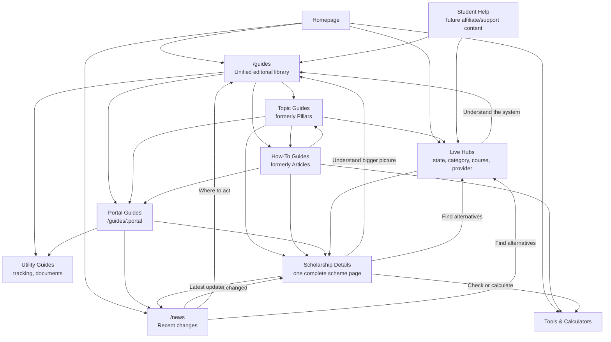

# IndiaScholarships Internal Linking Strategy

**Status:** Operating rulebook
**Last updated:** 2026-08-04
**Applies to:** scholarship details, live hubs, unified guides, news, tools, and future Student Help content.

This document reflects the current `scholarship-app` direction: Articles, Pillars, and Portal Guides are now publicly collapsed into the single `/guides` area. News remains separate.

---

## 0. Current Implementation Status

Use these labels when applying the strategy:

| Status | Meaning |
| --- | --- |
| Current | Already visible in templates, routes, redirects, or content model. Preserve and improve it. |
| Next implementation | Recommended work not fully rendered yet. |
| Legacy | Older strategy that should not be used for new links or new content. |

### Current

- `/guides` is the unified editorial index for topic guides, portal guides, utility guides, and how-to guides.
- `/guides/[portal]` works as the unified resolver for portal guide slugs, former pillar slugs, and former article slugs.
- `/pillars`, `/pillars/:slug`, `/articles`, and `/articles/:slug` redirect into `/guides`.
- Sitemaps now include article and pillar content under `/guides/:slug`.
- Scholarship detail pages already link to:
  - one best-fit guide via `getPillarForScholarship()`;
  - relevant news via `getNewsForScholarship()`;
  - relevant how-to guides via `getArticlesForScholarship()`;
  - similar scholarships;
  - sibling scheme variants;
  - discovery hubs;
  - the eligibility checker.
- Guides already use a shared editorial model through `lib/editorial.ts`.
- News already uses the shared `EditorialTemplate` and carries `targetMoneyLink` as `monetizationLink`.
- News pages already render affected scholarship cards, related hubs, and one broader related guide where available.

### Next Implementation

- Normalize all internal links to `/guides/:slug`; do not rely on `/articles` or `/pillars` redirects.
- Render `targetMoneyLink` / `monetizationLink` as a visible primary CTA in guide and news templates.
- Cap related news modules to the latest one to three genuinely relevant updates.
- Update older hardcoded links in templates, components, and markdown content that still point to `/articles/:slug` or `/pillars/:slug`.
- Add a clear `What to do now` box near the top of news pages.

### Legacy

- Do not create new scholarship detail subpages such as `/scholarships/:slug/eligibility` or `/scholarships/:slug/documents-required`.
- Do not create new hub subpages such as `/scholarships-in/:state/:subpage`.
- Do not create new internal links to `/articles`, `/articles/:slug`, `/pillars`, or `/pillars/:slug`.
- Portal guide subpages under `/guides/:portal/:subpage` are not legacy. They can continue where they serve a real procedural need such as login, status check, document list, or scholarship list.

---

## 1. The Content System

Each page type has one primary job.



| Public area | Job |
| --- | --- |
| `/guides` | Evergreen explanations, portal help, how-to walkthroughs, documents, tracking, and future support content. |
| `/news` | Recent updates, deadline changes, portal alerts, scheme launches, and disbursement updates. |
| Hubs | Live discovery pages showing current matching scholarships. |
| Scholarship details | One complete page for eligibility, amount, documents, dates, application, selection, renewal, and official source. |
| Tools | Calculators and checkers that reduce confusion or help the student decide. |

North star:

```text
News tells what changed.
Guides explain what to do.
Hubs show what is available.
Detail pages help the student apply.
Tools help the student check.
```

---

## 2. URL Rules

Use `/guides` as the only editorial namespace for new internal links.

Correct:

- `/guides/obc-scholarships-guide`
- `/guides/nsp-national-scholarship-portal-guide`
- `/guides/nsp`
- `/guides/nsp/documents-list`
- `/guides/pfms-scholarship-payment-status-tracking-guide`

Avoid for new links:

- `/articles/:slug`
- `/pillars/:slug`
- `/articles`
- `/pillars`

Redirects may remain for old URLs, but internal links should point directly to the canonical `/guides` destination.

---

## 3. Anchor Text Rules

Use concise, natural, descriptive anchor text.

Good examples:

- `NSP document checklist`
- `PM YASASVI eligibility rules`
- `scholarships for B.Tech students`
- `scholarship eligibility checker`
- `MahaDBT status-check guide`
- `Odisha scholarships guide`

Avoid:

- `click here`
- `read more`
- `this article`
- repeated exact-match SEO anchors
- long keyword-stuffed anchors

The text around a link should explain why the student should open it.

---

## 4. Unified Guides Strategy

`/guides` is one public library, but internally it should still contain distinct guide types. This keeps the navigation simple for students while preventing Antigravity or future editors from writing every page in the same style.

### Topic Guides

Formerly pillar pages. These explain a broader scholarship system.

Examples:

- OBC Scholarships Guide
- Odisha Scholarships Guide
- Corporate & Private Scholarships Guide
- Engineering & B.Tech Scholarships Guide

Rules:

- Link to the primary live hub above the fold.
- Link to genuinely relevant supporting hubs.
- Link to named scholarship details when a specific scheme is discussed.
- Show a limited set of live featured scholarships.
- Link to selected how-to guides, not every related guide.
- Link to a portal guide only where the portal is central to the topic.
- Link to the latest one to three relevant news updates when useful.

### Portal Guides

Portal guides are procedural. They help students complete a government portal task.

Examples:

- NSP guide
- SSP Karnataka guide
- Digital Gujarat guide
- e-Kalyan Jharkhand guide

Rules:

- Link to scholarships hosted on that portal.
- Link to relevant portal subpages such as login, status check, documents, and scholarships list.
- Link to document/tracking utility guides where they reduce errors.
- Link to relevant news only when the update affects the portal.
- Link to the matching topic guide only when conceptual context helps.

### How-To Guides

Formerly articles. These answer one narrow task, error, or scenario.

Examples:

- How to fix NSP OTR face authentication errors
- PM YASASVI selection and merit list guide
- PFMS scholarship payment tracking guide

Rules:

- Include two to four contextual internal links in the body.
- Link to the best next action using `targetMoneyLink`.
- Show relevant scholarship cards from `relatedScholarships`.
- Link to one broader topic guide through `relatedPillarSlug` only when the guide is truly a child topic.
- Link to sibling guides through shared `relatedPillarSlug` where available.

### Utility Guides

Utility guides solve repeat problems across many scholarships.

Examples:

- Documents checklist
- Application status tracking
- PFMS tracking

Rules:

- Link from scholarship details, portal guides, how-to guides, and tools when the utility reduces confusion.
- Do not bury these links at the bottom if the page's main task depends on them.

---

## 5. Scholarship Detail Page Rules

Scholarship detail pages are complete single pages, not parent pages for subpage clusters.

Each detail page should answer:

- Who can apply?
- How much support is available?
- What documents are needed?
- What are the important dates?
- How does the student apply?
- How are students selected?
- How does renewal work?
- Where is the official source?

Every scholarship detail page should link to:

1. One best-fit guide for broader context, using `getPillarForScholarship()`.
2. Relevant how-to guides, using `getArticlesForScholarship()`.
3. Relevant news, using `getNewsForScholarship()`.
4. The eligibility checker with pre-filled context where possible.
5. Similar scholarships.
6. Sibling scheme variants where they exist.
7. Discovery hubs: state, category, level, income, course, or provider type.
8. A portal guide where the application process depends on a specific portal.

Important: internal guide links from detail pages should use `/guides/:slug`, not `/articles/:slug` or `/pillars/:slug`.

Use compact in-page anchors instead of detail subpages:

- `#eligibility`
- `#income-limit`
- `#documents-required`
- `#last-date`
- `#selection-process`
- `#apply-online`
- `#renewal-process`

Do not add affiliate or Student Help links to ordinary scholarship detail pages unless the link directly helps with the application process.

---

## 6. Hub Rules

Hubs are live discovery pages. They should not duplicate topic guides.

Each hub should link to:

- Matching scholarship listings.
- One matching guide where a genuine match exists.
- A small number of related guides or tools that help the student act.
- Closely related hubs when useful.

Best-fit guide mapping:

| Hub type | Best guide |
| --- | --- |
| State hub | Matching state guide |
| Category hub | Matching category guide |
| Course hub | Matching course guide |
| Provider hub | Corporate & Private Scholarships guide |
| Portal-heavy hub | Relevant portal guide, only if it helps apply |

Avoid large walls of unrelated guide links.

All hub-to-guide links should use `/guides/:slug`.

---

## 7. News Rules

News answers: `What changed recently?`

News must send students to stable pages where they can act.

```text
News update -> correct stable page -> student action
```

Every news article should include:

1. One visible primary action CTA using `targetMoneyLink`.
2. Affected scholarship cards using `relatedScholarships`.
3. Related hubs only if they help discovery.
4. Zero or one broader guide, only when the update needs context.
5. A visible official-source or verification reference.

Recommended placement:

- Put a `What to do now` box immediately after the quick summary or takeaways.
- Use `targetMoneyLink` for the primary button.
- Use plain labels such as `Check scholarship details`, `Read application steps`, `Track payment status`, or `Open portal guide`.

Examples:

| News type | Primary link |
| --- | --- |
| Deadline extension | Scholarship detail page |
| NSP applications open | NSP portal guide |
| Payment/disbursement update | Scholarship detail or PFMS/status guide |
| New state scheme | Scholarship detail or state hub |
| Document rule change | Documents guide or portal guide |

Do not make News link mostly to more News. News should hand off to Details, Guides, Hubs, or Tools.

Freshness rules:

- Keep old URLs live if they retain search value.
- Show the publication date clearly.
- Link prominently to the current stable page.
- Remove outdated updates from latest-news modules.
- Never leave an old deadline as the final instruction.

---

## 8. Tools Rules

Tools should be linked when they reduce a student's uncertainty.

Use tools from:

- Scholarship detail pages when eligibility or income is unclear.
- Guides when the student needs to check documents, income, status, or fit.
- News when the update requires the student to verify something.

Do not place tool links as decorative links. The surrounding text should make the task clear.

Examples:

- `Check eligibility before applying`
- `Estimate family income before choosing schemes`
- `Use the status guide if your payment is pending`

---

## 9. Student Help Rules

Student Help is future editorial/support content for recommendations such as laptops, apps, courses, resume tools, or student services.

Keep it inside the `/guides` library or a clearly labelled subsection of it, not inside scholarship detail pages.

Rules:

- Link to a relevant scholarship hub or guide where useful.
- Include a plain affiliate disclosure when monetized.
- Prefer useful student context over shopping-list SEO.
- Do not force Student Help links from scholarship details, news, or topic guides.

Good fit:

- B.Tech laptop guide linked from an Engineering/B.Tech guide.
- Resume builder guide linked from a corporate scholarship application guide.

Poor fit:

- Laptop affiliate links on every scholarship detail page.
- Generic “best tools” links inside deadline news.

---

## 10. Metadata Rules

### Guides from former Articles

Use:

```yaml
targetMoneyLink: "/guides/nsp"
relatedScholarships:
  - "scholarship-slug-one"
  - "scholarship-slug-two"
relatedPillarSlug: "nsp-national-scholarship-portal-guide"
```

Rules:

- `targetMoneyLink` is the one best next step.
- `relatedScholarships` must contain only genuinely relevant scholarship slugs.
- `relatedPillarSlug` is optional and singular.
- When adding `relatedPillarSlug`, also add the guide slug to the target topic guide's `relatedArticleSlugs`.

### News

Use:

```yaml
targetMoneyLink: "/scholarships/example-scholarship"
relatedScholarships:
  - "example-scholarship"
```

Rules:

- `targetMoneyLink` should point to the stable action page.
- `relatedScholarships` should include only affected scholarships.
- If no scholarship is affected, point `targetMoneyLink` to the best guide, hub, or tool.

### Topic Guides

Use:

```yaml
hubLinks:
  - label: "All Odisha Scholarships"
    href: "/scholarships-in/odisha"
relatedArticleSlugs:
  - "odisha-emedhabruti-kalia-guide-2026"
```

Rules:

- `hubLinks` should point to live discovery pages.
- `relatedArticleSlugs` should point to selected supporting guides, not every vaguely related page.

Frontmatter is not enough. The template must render selected relationships as visible, crawlable links.

---

## 11. Link Placement And Quantity

Place links where students naturally need them:

- After explaining a requirement.
- Before a task begins.
- After a quick summary.
- In a `What to do now` box.
- In a small related-content module near the bottom.

Avoid:

- Several links in one sentence.
- Generic anchors.
- Repeating the same destination many times.
- Large unrelated link blocks.
- Links that interrupt instructions.

Default guide target: three to six meaningful internal destinations, plus relevant scholarship cards where appropriate.

Topic guides may have more links because they are navigation and authority pages, but links must still be selective.

---

## 12. Pre-Publish Checklist

- [ ] Does every link help a student take a clear next step?
- [ ] Is the anchor text specific and natural?
- [ ] Is the destination genuinely relevant?
- [ ] Does the page link back into a scholarship journey?
- [ ] Are all editorial links using `/guides/:slug` instead of `/articles/:slug` or `/pillars/:slug`?
- [ ] Does the page avoid duplicating an existing search intent?
- [ ] Are important links regular crawlable anchor links?
- [ ] Does each matching hub link to one best guide?
- [ ] Does each topic guide link to its live hub above the fold?
- [ ] Does each scholarship detail page link to no more than one best-fit broad guide?
- [ ] If `relatedPillarSlug` was added, was the reverse `relatedArticleSlugs` entry added?
- [ ] Does News include a visible primary action CTA?
- [ ] Do old news pages direct students to a current stable page?
- [ ] Are affiliate links disclosed and editorially useful?
- [ ] Are official facts linked to official sources where appropriate?
- [ ] If a genuine match does not exist, was the link left out instead of forced?

---

## 13. Final Principle

Do not manufacture SEO or AI signals with artificial linking.

Make the relationship clear:

- This update affects this scholarship.
- This guide explains this application task.
- This portal guide helps complete this form.
- This hub shows current options.
- This detail page helps the student apply.
- This tool checks this requirement.

If the relationship is clear and useful for a student, it is useful for search engines and AI systems too.
