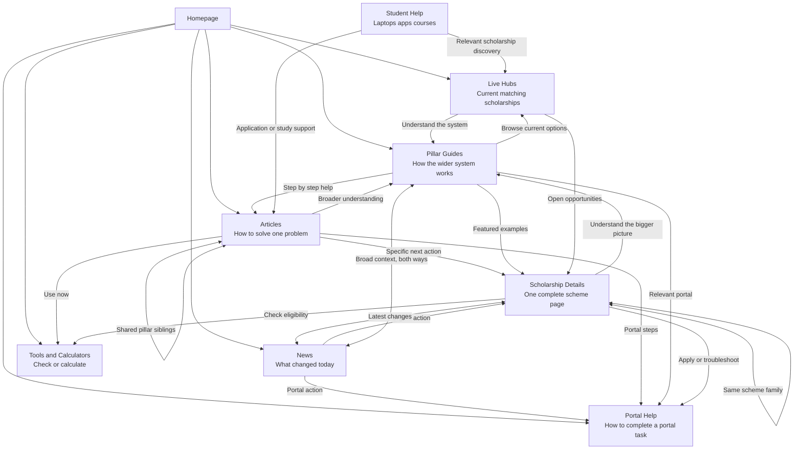

# IndiaScholarships Internal Linking Strategy

**Status:** Operating rulebook
**Last updated:** 2026-07-26
**Applies to:** scholarship details, hubs, pillar guides, portal guides, articles, news, tools, and Student Help content.

This document was originally drafted as a forward-looking rulebook, then reconciled against the actual codebase during an internal-linking audit and implementation pass on 2026-07-26. Every "Current" claim below has been verified against real code and confirmed live in a browser — this is not aspirational. Read section 0 and the "Golden rules" section first; they're the part most likely to save you from redoing work or reintroducing a bug that was already found and fixed once.

---

## 0. Implementation status

Use these labels when applying the strategy:

| Status | Meaning |
| --- | --- |
| Current | Built, verified live, and reciprocal where the rule calls for it. Preserve and extend it — don't rebuild from scratch. |
| Next implementation | Recommended work not yet done. |
| Deliberate exception | Looks like a gap but isn't — a specific case where the rule was checked and intentionally not applied, with the reason recorded so it isn't "fixed" by mistake later. |
| Legacy strategy | Older direction that should not be used for new work. |

### Current (built and verified 2026-07-26)

- **Scholarship detail → Pillar**: `getPillarForScholarship()` in `lib/pillars.ts` resolves one best-fit pillar per scholarship (priority: state → corporate/private → course → category → level) and renders as an "Understand the Bigger Picture" callout in `app/scholarships/[slug]/page.tsx`, placed above "About the Program," not in the sidebar.
- **News ↔ Pillar, both directions**: `getNewsForPillar()` and reuse of `getPillarForScholarship()` in `app/news/[slug]/page.tsx` and `app/pillars/[slug]/page.tsx`.
- **Article ↔ Article**: `getRelatedArticles()` in `lib/articles.ts` clusters sibling articles by shared `relatedPillarSlug`, rendered as a "More on This Topic" block.
- **Footer → Pillar**: a "Scholarship Guides" link to `/pillars` in `app/components/Footer.tsx`, present on every page.
- **`scholarships-by-university` in nav**: desktop mega-menu and mobile menu both link to it now (`app/components/Header.tsx`).
- **`scholarships-by-university` → Pillar, selectively**: `University.relatedPillarSlug` in `lib/universities.ts` is set only for institutions with a genuine single-discipline fit (IITs/NITs/BITS/VIT/Anna University/VTU → Engineering; SPPU → Maharashtra; AKTU → UP). General multi-faculty universities (DU, JNU, BHU, AMU, JMI, UoH, Ashoka) are left unset on purpose — see "Deliberate exceptions" below.
- **Home's pillar grid**: driven by a `featured: true` frontmatter flag (`getFeaturedPillars()` in `lib/pillars.ts`), not a hardcoded slug array. Adding/removing a home-featured pillar is a one-line content edit, not a code change.
- **Sibling-variant cross-linking is fully generic**: `getSiblingVariants()` in `lib/db.ts` handles PM-YASASVI's branches (base, Top Class, J&K, Manipur, DNH&DD) the same way it handles Digital Gujarat, OASIS, SSP, etc. There is no more per-scheme hardcoded cross-link block on the scholarship detail page. The variant-picker labels by **state** when a sibling's state differs from the current page, and falls back to **category** when siblings share a state — this is itself a generic rule, not a PM-YASASVI special case.
- **Detail-page sub-pages are retired, not just discouraged**: `/scholarships/:slug/eligibility` etc. 301-redirect (see `next.config.ts`) rather than rendering separate pages. Compact in-page anchors (`#eligibility`, `#documents-required`, etc.) exist on the page itself, exposed via matching desktop and mobile pill navs (`SUBPAGE_METRICS` in `app/scholarships/[slug]/page.tsx`). The old sidebar "Supporting Guides" list that linked to the retired URLs has been deleted — it was fully redundant with the pill navs.
- Everything the original draft already listed as current (related news/articles/similar scholarships/eligibility-checker/hub links on detail pages; `relatedScholarships`/`relatedPillarSlug` on articles; `relatedScholarships`+hub inference on news; pillar callouts on state/category/level/course/corporate/private hubs; pillar→hub/article/scholarship linking) is still current and unchanged.

### Next implementation (not done, still worth doing)

- Render `targetMoneyLink` as a visible primary CTA in article and news templates (the field is stored and used as a fallback default, but never rendered as a distinct CTA button).
- Limit scholarship/portal pages to the latest one to three relevant news updates (currently unbounded).
- `relatedGuide` / `relatedTool` frontmatter fields described in section 11 don't exist in `lib/articles.ts` / `lib/news.ts` yet — treat that YAML block as a proposal, not a description of current fields.
- Student Help (section 10) doesn't exist as a content type anywhere in the repo — no route, no content directory. Treat section 10 as a future content-strategy proposal, not a current pattern.

### Deliberate exceptions (checked, and intentionally not linked — do not "fix" these)

- **`content/articles/india-scholarships-statistics-2025-2026.md`** has no `relatedPillarSlug`. It's a national cross-cutting stats report (budget outlays, CSR, international mobility) with no single matching pillar. Forcing one would misrepresent the article.
- **`content/articles/single-girl-child-scholarship-guide.md`** has no `relatedPillarSlug`. It spans a CBSE national scheme and an AICTE engineering scheme with no shared pillar, and there is no "girls" pillar to link to honestly.
- **General multi-faculty universities** (Delhi University, JNU, BHU, AMU, JMI, University of Hyderabad, Ashoka, Manipal/MAHE) have no `relatedPillarSlug` in `lib/universities.ts`. They teach across too many disciplines to honestly point at any single existing pillar (e.g. Engineering).
- If a new pillar is later added that legitimately covers one of the above (e.g. a "General/Multi-Discipline Universities" pillar, or a "Girls' Scholarships" pillar, or a "National Statistics" pillar), revisit these — they were skipped for lack of a true match, not out of neglect.

### Legacy strategy (confirmed, do not reintroduce)

- Do not create new scholarship detail subpages (`/scholarships/:slug/eligibility` etc.) or hub subpages (`/scholarships-in/:state/:subpage`). These are 301-redirected in `next.config.ts` to the parent page's in-page anchor pattern — confirmed still true as of this update.
- Portal guide subpages (`/guides/:portal/:subpage`) are a different, still-current pattern — they serve real procedural intent (status check, login, document list) and are not part of this deprecation.

---

## Golden rules for future work (read this before adding any link)

These are the principles that produced every fix above. Follow them over any single line-item rule below if they conflict.

1. **Reuse the existing reverse-lookup pattern before writing a new one.** The site already has `getPillarForCategory/State/Level/ProviderType/Course()` in `lib/pillars.ts`, `getPillarForScholarship()` (composes the above), `getNewsForPillar()` / `getNewsForState()` in `lib/news.ts`, `getRelatedArticles()` in `lib/articles.ts`, and `getSiblingVariants()` in `lib/db.ts`. If a new content type needs "find the matching X," check these first — a new one-off hardcoded block is very likely solving an already-solved problem.
2. **Never hardcode a per-slug or per-scheme special case in a page template.** The PM-YASASVI block was the clearest example of this going wrong: it covered only 2 of 5 real variants and had to be manually maintained. If you're tempted to write `if (slug === 'x')`, ask whether the underlying pattern (shared keyword, shared state, shared category) can be expressed as data instead.
3. **A missing link is better than a wrong one.** Multiple decisions in this pass were "don't add this link" — general universities, the stats-report article, the single-girl-child article. When a genuine, honest match doesn't exist, leave the link out and record why (see "Deliberate exceptions"), rather than forcing a plausible-looking but inaccurate connection.
4. **Make new content-model fields reciprocal by construction.** `relatedPillarSlug` on an article should be mirrored by that slug appearing in the pillar's `relatedArticleSlugs`. When you add one side of a relationship, add the other side in the same change.
5. **Verify with real data, not just types.** `tsc --noEmit` passing does not mean the feature works — several bugs here (the `course_stream` array-vs-string crash, the `getSiblingVariants` keyword-length bug) only showed up when checked against actual DB rows in a running preview. Sample at least 3–5 real records (including edge cases: no state, multiple categories, international scope) before calling a linking feature done.
6. **When generalizing a labeling/matching rule, re-verify every existing caller, not just the new one.** Changing the sibling-variant label priority to support PM-YASASVI's state-based branches was correct, but it also surfaced that the underlying match query was already broken for Digital Gujarat. Fix the root cause, not just the symptom that prompted the change.

---

## 1. Purpose

Internal links must help a student take the next useful step. They must also make the relationship between pages clear to search engines and AI systems.

Do not add links merely to increase link counts. Every link must be relevant to the student's current question.

Every important page must receive at least one crawlable internal link from another relevant page.

---

## 2. The content system

Each page type has one primary job. Do not make two page types target the same intent.



| Page type | Student question |
| --- | --- |
| News | What changed this week? |
| Article | How do I solve this specific problem? |
| Pillar | How does this whole scholarship system work? |
| Hub | What scholarships can I apply for right now? |
| Scholarship detail | Can I apply for this exact scholarship, and what should I do next? |
| Portal guide | How do I complete this portal task? |
| Tool | Can I check or calculate this now? |
| Student Help | What student product, app, course, or service should I choose? |

---

## 3. Link-writing rules

Use concise, natural, descriptive anchor text.

Good examples:

- `NSP document checklist`
- `PM YASASVI eligibility rules`
- `scholarships for B.Tech students`
- `scholarship eligibility checker`
- `MahaDBT status-check steps`

Avoid generic anchors such as `click here`, `read more`, and `this article`. Do not force long keyword phrases or repeat one exact anchor everywhere.

Use natural variations. A scholarship page may be linked as `PM YASASVI Scholarship details`, `PM YASASVI eligibility`, or `check PM YASASVI requirements`.

The words before and after a link must explain why the student should open it.

---

## 4. Pillar-guide strategy

**Status:** Current, end to end — pillar-to-hub, hub-to-pillar, pillar-to-article, article-to-pillar, pillar-to-news, news-to-pillar, and detail-to-pillar are all built and verified.

Pillars are the evergreen authority layer. They explain a broad scholarship system, while hubs show live inventory and detail pages provide exact facts.

### Pillar rules

Every pillar must:

1. Link to its primary live hub above the fold.
2. Link to all genuinely relevant supporting hubs, but not unrelated directories.
3. Link to named scholarship details when a specific scheme is discussed. Automatic links are acceptable only when the title match is unambiguous (see `autoLinkScholarshipMentions()` in `lib/pillars.ts`).
4. Show a limited set of live featured scholarships and link to the complete hub list.
5. Link to zero to four genuinely useful step-by-step articles.
6. Link to a portal guide only where that portal is central to the pillar's topic.
7. Show its latest one to three relevant news updates, via `getNewsForPillar()`, when any exist.

Do not turn a pillar into an article directory. Pillars should select only the most useful procedural articles.

To feature a pillar on the homepage, set `featured: true` in its frontmatter — do not add it to a hardcoded list anywhere in `app/HomeClient.tsx` or `app/page.tsx`.

### Hub to pillar rules

When a matching pillar exists, the associated state, category, level, course, corporate, or private hub must display one above-the-fold `Read the complete guide` callout. This uses `getPillarForCategory/State/Level/ProviderType/Course()` in `lib/pillars.ts` — reuse these, don't write a new lookup.

This is the standard relationship:

```text
Pillar explains the system → Hub shows the current list → Detail page gives exact eligibility and application information
```

### Detail to pillar rules

**Status: Current.** Each scholarship detail page links to **one best-fit pillar** via `getPillarForScholarship()` in `lib/pillars.ts`, rendered as an "Understand the Bigger Picture" callout above "About the Program." Never link to every related pillar.

The actual, implemented priority order is:

1. State (if not "All India" / "Multiple States" / "Selected States" / "Selected Cities") → matching state pillar.
2. Provider type "Corporate" or "Private" → Corporate & Private Scholarships pillar.
3. `course_stream` (tokenized, comma/slash-split) → matching course pillar.
4. `caste` array (tried in order) → matching category pillar.
5. `level` (tokenized) → matching level pillar. (No pillar currently populates `clusterLevels`, so this tier is a dormant fallback, not dead code — it activates automatically the moment any pillar's frontmatter adds `clusterLevels`.)

There is no separate NSP-specific tier — an NSP-centric scholarship falls through to whichever of the above actually applies to it (usually category). If NSP-context linking specifically matters for a scholarship, that's better expressed via a `clusterProviderTypes`/portal field than a bespoke tier.

Examples (verified live):

- Odisha SC government scheme → Odisha Scholarships pillar (state beats category).
- Tata Capital Pankh (All India, corporate) → Corporate & Private Scholarships pillar.
- AICTE engineering scheme → Engineering & B.Tech pillar.
- National OBC scheme with no state/course match → OBC Scholarships pillar (category fallback).

---

## 5. Scholarship detail page rules

**Status:** Current for related articles, related news, similar scholarships, eligibility checker links, hub links, one best-fit pillar callout, and compact in-page navigation. Legacy strategy for detail subpages (confirmed retired).

Scholarship details are complete single pages, not parent pages for subpage clusters.

Each detail page should answer the student's core questions directly on the page:

- Who can apply?
- How much support is available?
- What documents are needed?
- What are the important dates?
- How does the student apply?
- How are students selected?
- How does renewal work, if applicable?

Every scholarship detail page should link to:

1. One relevant portal guide, when the scholarship uses that portal. *(Next implementation — no `/guides/` link currently exists on this template.)*
2. One relevant problem-solving article, only when it solves a likely issue. — Current, via `getArticlesForScholarship()`.
3. The pre-filled eligibility checker where available. — Current.
4. Three similar active scholarships, matched by state, level, category, income, or course. — Current, via `getRelatedScholarships()`.
5. Sibling scheme variants (same scheme family, different state/category/branch) via `getSiblingVariants()` — Current, and fully generic (no per-scheme hardcoding).
6. Relevant discovery hubs: state, category, level, income, and scholarship type. — Current, "Discover More" sidebar.
7. The latest relevant news updates via `getNewsForScholarship()`. — Current. *(Capping to 1–3 is still Next implementation — currently unbounded.)*
8. One best-fit pillar, using `getPillarForScholarship()`. — Current.

Do not add Student Help or affiliate links to ordinary scholarship detail pages unless they directly help with the application process.

Use compact in-page navigation instead of separate subpages. The implemented anchors (both desktop toolbar and mobile pill nav, driven by the shared `SUBPAGE_METRICS` object in `app/scholarships/[slug]/page.tsx`):

- `#eligibility`
- `#income-limit`
- `#documents-required`
- `#last-date`
- `#selection-process`
- `#apply-online`
- `#renewal-process`

There is no separate sidebar link list for these anymore — it was removed as fully redundant with the pill navs. **Do not re-add a sidebar list linking to `/scholarships/:slug/eligibility`-style URLs** — those routes 301-redirect back to this same page, so a sidebar link to them is always a wasted redirect hop, not a real destination.

Place the most important next action near the top of the page, usually one of:

- `Check eligibility`
- `Apply through the official portal`
- `Read application steps`
- `See similar scholarships`

---

## 6. Portal Help rules

**Status:** Current for portal guide routes and portal procedural pages. Review case by case before expanding portal subpages.

Portal guides are procedural. Pillars are conceptual. Keep both when their intent differs.

Example:

- The NSP pillar explains what NSP is, how it differs from state systems, and why applications get stuck.
- The NSP portal guide explains registration, login, document upload, status checks, and renewal.

Every portal guide should link to:

- Three to six scholarships hosted on that portal.
- Related portal tasks: registration, login, documents, status check, and renewal.
- One troubleshooting article where students commonly get stuck.
- One useful tool where it reduces errors.
- The latest one to three updates about the portal.
- The matching conceptual pillar when one exists.

---

## 7. Article rules

**Status:** Current for related scholarship cards, pillar callouts, and article-to-article clustering. Next implementation for a visible `targetMoneyLink` CTA.

Articles answer a narrow problem or scenario. They should not duplicate a direct scholarship lookup or portal-task page.

Every article should include:

- Two to four contextual internal links in the body.
- One primary next-step CTA after the main answer. *(Next implementation — `targetMoneyLink` is stored but not rendered as a distinct CTA yet.)*
- Two to three relevant scholarship cards at the bottom. — Current.
- One portal guide or tool only when useful.
- One pillar callout when the article is a narrow topic inside a broader scholarship system. — Current, via `PillarGuideCallout` + `relatedPillarSlug`.
- A "More on This Topic" module of sibling articles sharing the same pillar. — Current, via `getRelatedArticles()` in `lib/articles.ts`. This is the only article-to-article mechanism; there is no separate tagging or topic-cluster system, so an article with no `relatedPillarSlug` will never show this module (that's expected, not a bug).

Example for an NSP OTR error article:

1. Link to the NSP portal guide for the action.
2. Link to the NSP pillar for broader understanding.
3. Link to the document checklist when it supports the step.
4. Show two or three scholarships available through NSP.

Articles should link to a pillar when they are a child topic of that system. Do not force a pillar link into every article — two articles in the current content set (`india-scholarships-statistics-2025-2026`, `single-girl-child-scholarship-guide`) were deliberately left without one; see "Deliberate exceptions."

When you do assign `relatedPillarSlug` to an article, also add that article's slug to the target pillar's `relatedArticleSlugs` in the same change — this is what makes both the pillar→article list and the article→article "More on This Topic" module work correctly.

---

## 8. News rules

**Status:** Current for related scholarship cards, related hub links, and pillar linking (both directions). Next implementation for a visible `targetMoneyLink` CTA and freshness filtering.

News answers `What changed today?` It must send students to stable pages where they can take action.

```text
News update → correct stable page → student action
```

Every news article must include:

1. One visible primary action CTA using `targetMoneyLink`. *(Next implementation — stored but not rendered as a distinct CTA.)*
2. Two to five genuinely affected scholarship cards using `relatedScholarships`. — Current.
3. One relevant portal guide, article, or tool when it helps students complete the action.
4. One clearly labelled official-source link. — Current ("Verified via search grounding" trust banner).

Place a `What to do now` box immediately after the quick summary.

Examples:

- Deadline extension → scholarship detail page.
- NSP applications open → NSP portal guide.
- Payment update → scholarship detail page or PFMS guide.
- New state scheme → state hub or new scholarship detail page.
- Document rule change → documents guide.

News may link to a pillar only when broad context helps, such as a nationwide NSP policy change or a state-wide system change. A normal deadline update does not need a pillar link. **This is now implemented as a real, working rule, not just guidance**: `app/news/[slug]/page.tsx` resolves a pillar via `getPillarForScholarship()` on the news item's first related scholarship, so it naturally returns `null` (no callout) for news with no state/category/course signal, and a real pillar for news that has one — no manual judgment call needed per news item.

The reverse direction also exists: pillar pages show their latest matching news via `getNewsForPillar()` in `lib/news.ts`, which matches on the pillar's `clusterStates`/`clusterCategories` plus an NSP-specific keyword check. This is a substring/keyword match against news titles, not a hand-curated list — if a pillar's related news looks wrong or incomplete, check the keyword match first before adding a manual override.

### News freshness rules

When an update is old:

- Keep the URL live when it retains search value.
- Show its publication date clearly.
- Link prominently to the current scholarship or portal page.
- Remove it from latest-news modules when it is outdated.
- Never leave an old deadline as the student's final instruction.

Scholarship and portal pages should display only the latest one to three relevant updates. *(Still Next implementation — currently unbounded on the scholarship detail page.)*

---

## 9. Hub rules

**Status:** Current for pillar callouts on state, category, level, course, corporate, private, and (selectively) university hubs. Legacy strategy for hub subpages (confirmed retired).

Hubs are live discovery pages. They should not duplicate the pillar's explanatory content.

Each hub should link to:

- Matching scholarship listings.
- A matching pillar guide, where one genuinely exists — via the `getPillarFor*()` family in `lib/pillars.ts` for state/category/level/course/provider-type hubs, and via `University.relatedPillarSlug` for the university hub (`app/scholarships-by-university/[slug]/page.tsx`), which is intentionally left unset for general multi-faculty universities rather than forced.
- Three to six useful guides, articles, or tools that help the reader act.
- Closely related hubs when useful.

Avoid large walls of unrelated links.

`scholarships-by-university` is a first-class hub now, present in both desktop and mobile nav (`app/components/Header.tsx`) — it is not an exception to this section anymore.

---

## 10. Student Help rules

**Status:** Proposed content strategy only. No Student Help route, content directory, or frontmatter fields exist in the repo as of this writing — do not assume any of the following is built.

Student Help is a topic inside the editorial layer for student-focused recommendations, including laptops, apps, courses, resume builders, and budgeting services.

Every Student Help article should link to:

- One relevant scholarship or scholarship hub.
- One relevant guide or tool where useful.
- A plain-language affiliate disclosure.
- Helpful next actions, not only affiliate buttons.

Do not force Student Help links from scholarship details or pillars. A course pillar may include one relevant Student Help link when it genuinely supports the topic, such as a B.Tech pillar linking to a B.Tech laptop guide.

---

## 11. Content metadata reference

**Status:** Reflects the actual fields in `lib/articles.ts`, `lib/news.ts`, and `lib/pillars.ts` as of 2026-07-26.

Articles (`ArticleMetadata` in `lib/articles.ts`):

```yaml
id: "ART-102"
title: "..."
slug: "..."
relatedPillarSlug: "nsp-national-scholarship-portal-guide"   # optional, singular
targetMoneyLink: "/guides/nsp"                                 # stored; not yet rendered as a CTA
relatedScholarships:
  - "scholarship-slug-one"
  - "scholarship-slug-two"
```

`relatedGuide` and `relatedTool` do **not** exist as fields yet — if you need them, add them to `ArticleMetadata`/`NewsMetadata` and their `toMetadata()`-equivalent parsers first; don't assume they're already wired up because an older draft of this doc mentioned them.

News (`NewsMetadata` in `lib/news.ts`) follows the same `relatedScholarships` / `targetMoneyLink` pattern, with news→pillar and pillar→news resolved automatically (see section 8) rather than via a stored field.

Pillars (`PillarMetadata` in `lib/pillars.ts`):

```yaml
id: "PILLAR-20"
title: "..."
slug: "..."
featured: true                # optional — drives the homepage pillar grid; omit or set false otherwise
clusterCategories: ["OBC"]
clusterStates: []
clusterLevels: []              # not currently populated by any pillar — see section 4
clusterProviderTypes: []
clusterCourses: []
hubLinks:
  - label: "All OBC Scholarships"
    href: "/scholarships-for/obc"
relatedArticleSlugs:
  - "obc-postmatric-scholarship-rules-2026"
```

Rules:

- `targetMoneyLink` is the one best next page for the student — stored on both articles and news, rendering as a CTA is still open work.
- `relatedScholarships` contains only genuinely relevant scholarship pages.
- `relatedPillarSlug` is optional and singular on articles. When you set it, also add the article's slug to the target pillar's `relatedArticleSlugs` — this is what makes the relationship reciprocal (pillar→article list) and enables the article-to-article "More on This Topic" clustering, which groups purely by shared `relatedPillarSlug`.
- `featured: true` on a pillar surfaces it on the homepage grid (capped at 6 by `getFeaturedPillars(6)`). There is no equivalent `featured` flag for articles — the homepage's single article promo banner is bespoke, hand-written copy about one specific report, not a generic "featured article" slot, and was deliberately left that way rather than genericized.
- Frontmatter is not enough. The template must render every selected relationship as a visible, crawlable link.

---

## 12. Link placement and quantity

Place links where students naturally need them:

- After a requirement is explained.
- Before a task begins.
- At the end of a section.
- In a `What to do next` box.
- In a small related-content module near the bottom.

Avoid:

- Several links in one sentence.
- Generic link text.
- Repeating one destination many times.
- Large unrelated link blocks.
- Links that interrupt instructions.

Default for a standard article: three to six meaningful internal destinations, plus relevant scholarship cards. Pillar pages may have more links because they are explicitly navigation and authority pages, but their choices must still be selective and topic-specific.

---

## 13. Pre-publish checklist

- [ ] Does every link help a student take a clear next step?
- [ ] Is the anchor text specific and natural?
- [ ] Is the destination genuinely relevant?
- [ ] Does the page link back into a scholarship journey?
- [ ] Does the page avoid duplicating an existing search intent?
- [ ] Are important links regular crawlable anchor links?
- [ ] Does each matching hub link to its pillar?
- [ ] Does each pillar link to its live hub above the fold?
- [ ] Does a scholarship detail page link to no more than one best-fit pillar?
- [ ] If you added `relatedPillarSlug` to an article, did you also add its slug to the pillar's `relatedArticleSlugs`?
- [ ] Does News include a visible primary action CTA? *(Still open — see section 8.)*
- [ ] Do old news pages direct students to a current stable page?
- [ ] Are affiliate links disclosed and editorially useful?
- [ ] Are official facts linked to official sources where appropriate?
- [ ] If a genuine match doesn't exist, did you leave the link out and note why, instead of forcing one?

---

## 14. Final principle

Do not manufacture SEO or AI signals with artificial linking.

Make the relationship clear:

- This update affects this scholarship.
- This portal guide helps complete this application.
- This article solves this student problem.
- This pillar explains the wider system.
- This tool checks this requirement.
- These scholarships are appropriate alternatives.

If the relationship is clear and useful for a student, it is useful for search engines and AI systems too.
