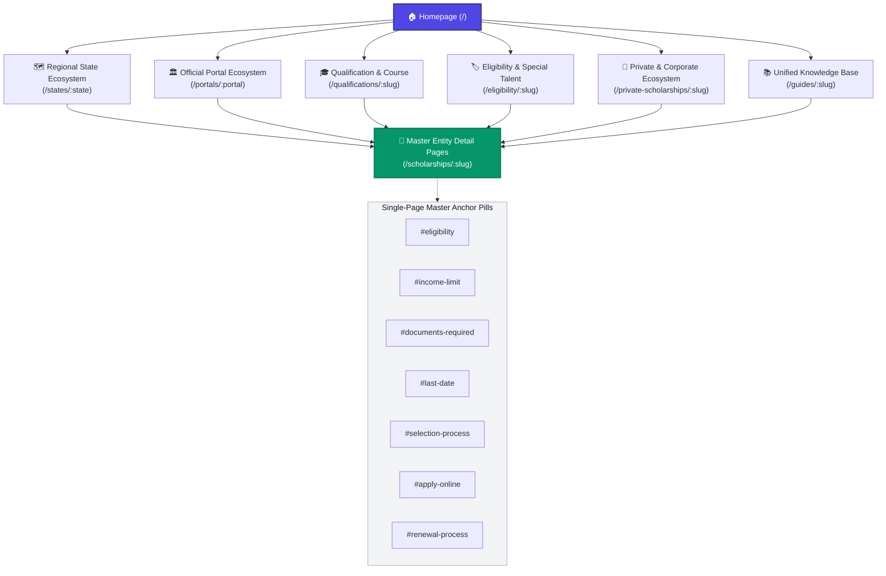
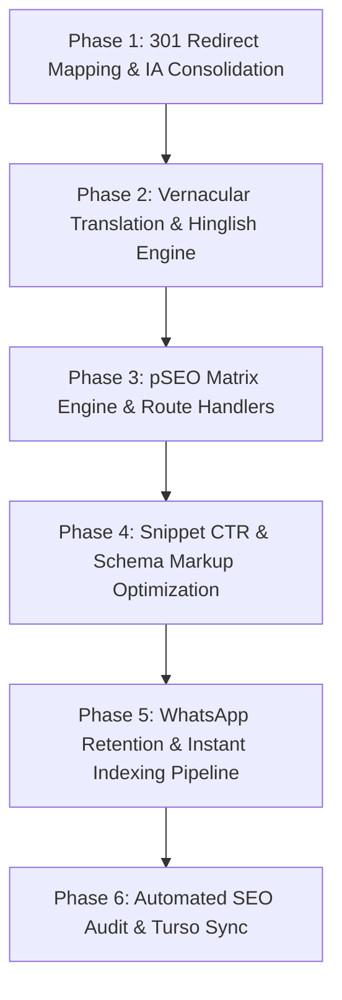

# Master IA & Traffic Maximization Reorganization Blueprint

This document represents the definitive **Master Information Architecture (IA) Reorganization Blueprint** for **India Scholarships (`indiascholarships.in`)**. It consolidates the strategy, cluster hierarchy, 301 redirect preservation matrix, Programmatic SEO (pSEO) engine, Vernacular & Phonetic Search Engine, and execution roadmap into a permanent reference document inside the project repository.

---

## 📍 Executive Summary & Rationale

As India Scholarships grows, transitioning from flat, fragmented filter routes (e.g., separate `/scholarships-by-education`, `/scholarships-by-category`, `/scholarships-for`) to a **Strict Siloed 6-Cluster Hub-and-Spoke Pyramid** maximizes search engine topical authority, improves user navigation, and unlocks hyper-specific student search intent.

### Core Architectural Gains:
1. **Topical Authority Silos**: Search engines can instantly parse parent-child thematic relationships across all 6 core master clusters.
2. **Zero SEO Juice Loss**: A 301 Permanent Redirect Matrix guarantees that 100% of accumulated PageRank and backlinks pass directly to the new cluster hubs.
3. **pSEO Long-Tail Engine**: Programmatic landing pages capture hyper-specific search queries (`[qualification] + [category] + [state]`).
4. **Vernacular & Hinglish Capture**: Addresses the 65%+ of Indian students searching in native scripts or typing local language queries in English letters (Hinglish, Tanglish, Kanglish).
5. **Position Zero & High CTR**: Formatted direct-answer H2 tables, JSON-LD schemas (`FinancialProduct`, `HowTo`, `FAQPage`), and year/disbursement amount title engineering.

---

## 🏗️ Master Architectural Tree (The 6 Core Clusters)

---

## 📂 Detailed Breakdown of the 6 Master Clusters

### 1. Regional State Ecosystem (`/states/`)
* **Base Path**: `/states/[state]` (e.g. `/states/karnataka`, `/states/uttar-pradesh`, `/states/madhya-pradesh`).
* **Content Structure**: Features a **Master Comparison Matrix Table** comparing all active state schemes, direct jump cards to official state portals, and section anchors.
* **Target Intent**: *"Scholarships in Karnataka"*, *"UP scholarship 2026 application form"*.

### 2. Official Portal Ecosystem (`/portals/`)
* **Base Path**: `/portals/[portal]` (e.g. `/portals/national-scholarship-portal-nsp`, `/portals/ssp-karnataka`, `/portals/mahadbt-maharashtra`).
* **Subpages**: `/portals/[portal]/status-check`, `/portals/[portal]/student-login`, `/portals/[portal]/documents-list`.
* **Content Structure**: Top Scholarships Hosted Grid, official login/registration walkthroughs, and sidebar Helpdesk CTAs.
* **Target Intent**: *"NSP student login"*, *"SSP Karnataka status check 2026"*, *"MahaDBT freeship status"*.

### 3. Qualification & Course Hierarchy (`/qualifications/`)
* **Base Path**: `/qualifications/[slug]`
* **Broad Level Sub-Hubs**: `/qualifications/pre-matric`, `/qualifications/post-matric`, `/qualifications/undergraduate`, `/qualifications/postgraduate`, `/qualifications/phd`.
* **Course Specific Sub-Hubs**: `/qualifications/engineering`, `/qualifications/medical-mbbs`, `/qualifications/law`, `/qualifications/polytechnic-diploma`.
* **Target Intent**: *"Scholarships for B.Tech students"*, *"UG scholarships after 12th"*.

### 4. Eligibility & Special Talent (`/eligibility/`)
* **Base Path**: `/eligibility/[slug]`
* **Social Categories**: `/eligibility/sc-scholarships`, `/eligibility/st-scholarships`, `/eligibility/obc-scholarships`, `/eligibility/ews-scholarships`, `/eligibility/minority-scholarships`.
* **Gender & Identity**: `/eligibility/girl-students`, `/eligibility/single-girl-child`, `/eligibility/women-researchers`.
* **Special Talent & Sports**: `/eligibility/sports-scholarships` (National/State/District athletes), `/eligibility/arts-and-culture`, `/eligibility/innovators-and-stem`.
* **Special Inclusion**: `/eligibility/pwd-disability`, `/eligibility/defense-personnel`, `/eligibility/single-parent-orphan`.

### 5. Private & Corporate Ecosystem (`/private-scholarships/`)
* **Base Path**: `/private-scholarships/[slug]`
* **Corporate CSR**: `/private-scholarships/csr-corporate` (Reliance Foundation, HDFC Parivartan, SBI Asha, Tata Capital Pankh).
* **Trusts & Foundations**: `/private-scholarships/trusts-foundations` (Foundation for Excellence, Narotam Sekhsaria, Jindal).
* **Private University**: `/private-scholarships/university` (BITS Pilani Merit, Amity Grants).
* **Study Abroad**: `/private-scholarships/study-abroad` (Chevening, Rhodes, Fulbright).
* **Target Intent**: *"Top CSR scholarships in India"*, *"Private scholarships for engineering"*.

### 6. Single-Page Master Directory (`/scholarships/`)
* **Base Path**: `/scholarships/[slug]`
* **Content Structure**: Direct Answer Lead Block, 3 Mini-Tables (Eligibility Matrix, Required Documents, Selection Schedule), and sticky `#anchor` jump pills (`#eligibility`, `#documents-required`, `#last-date`, `#apply-online`, `#faqs`).

---

## ⚡ Programmatic SEO (pSEO) Matrix Engine

The platform dynamically combines taxonomy attributes to generate hyper-specific long-tail landing pages matching exact student query patterns:

$$\text{Pillar 1 (Qualification)} + \text{Pillar 2 (Eligibility / Category)} + \text{Pillar 3 (State)}$$

### High-Traffic pSEO Combination Examples:
* `/qualifications/btech/sc-category/maharashtra` (*"B.Tech Scholarships for SC Students in Maharashtra"*)
* `/eligibility/girl-students/postgraduate/income-below-2-5-lakhs` (*"PG Scholarships for Girl Students under 2.5 Lakhs Income"*)
* `/qualifications/10th-pass/sports-scholarships/haryana` (*"10th Pass Sports Scholarships in Haryana"*)

> **Anti-Thin Content Guardrail**: Programmatic landing pages are only generated when $\ge 2$ verified active schemes exist for the target filters. Every generated page includes a unique aggregate lead summary, comparison matrix table, and custom 3-step application checklist.

---

## 🌐 Vernacular & Phonetic Search Engine

To capture the **65%+ of Indian students** who search in native scripts or Romanized local language text (Hinglish/Tanglish/Kanglish):

### 1. Native Script Translation Pipeline (`/hi/`, `/bn/`, `/ta/`, `/te/`, `/kn/`, `/or/`)
* Native language localized routes under `app/[locale]/`.
* **Staleness Solution (`source_hash`)**: A `SHA-256` hash of concatenated scholarship attributes is stored in `scholarship_translations`. When official deadlines or amounts update in SQLite/Turso, the script automatically detects hash mismatches and re-translates *only* updated records.
* **Hreflang Compliance**: Every template emits clean `<link rel="alternate" hreflang="...">` tags for all 6 supported Indian languages.

### 2. Phonetic Romanized Intent Engine (Hinglish, Tanglish, Kanglish, Benglish)
* Captures queries typed in English script for local languages (e.g. *"UP scholarship last date kab hai"*, *"NSP scholarship apply kaise kare"*, *"documents kya lagega"*).
* Dedicated **Phonetic FAQ Accordions** embedded on Portal Guides and Master Pages with valid `FAQPage` JSON-LD schema markup.

---

## 🛡️ 100% PageRank Preservation & 301 Redirect Matrix

To guarantee zero loss of search rankings, indexed URLs, or backlinks, the migration follows a **Strict 3-Tier Redirect Protocol**:

### 301 Redirect Mapping Matrix

| Legacy / Current Path Pattern | New Target Cluster Path Pattern | Redirect Type | Reason & SEO Preservation Strategy |
| :--- | :--- | :--- | :--- |
| `/:locale/scholarships/:slug/:subpage*` | `/:locale/scholarships/:slug#:subpage` | 301 Permanent | Preserves localized master page authority; redirects subpages to section anchors. |
| **`/guides/nsp/:subpage*`** | **`/portals/national-scholarship-portal-nsp/:subpage*`** | 301 Permanent | Maps National Scholarship Portal guide to dedicated `/portals/` hub. |
| **`/guides/ssp-karnataka/:subpage*`** | **`/portals/ssp-karnataka/:subpage*`** | 301 Permanent | Maps Karnataka SSP Portal guide & subpages to `/portals/`. |
| **`/guides/mahadbt/:subpage*`** | **`/portals/mahadbt-maharashtra/:subpage*`** | 301 Permanent | Maps Maharashtra MahaDBT Portal guide & subpages to `/portals/`. |
| `/scholarships-by-education/:slug*` | `/qualifications/:slug*` | 301 Permanent | Preserves education level backlinks (UG, PG, B.Tech, 10th Pass). |
| `/scholarships-by-category/:slug*` | `/eligibility/:slug*` | 301 Permanent | Preserves caste/category backlinks (SC, ST, OBC, EWS, Minority). |
| `/scholarships-for/:slug*` | `/eligibility/:slug*` | 301 Permanent | Preserves demographic backlinks (Girls, PwD, Sports, Single Girl Child). |
| `/corporate-scholarships/:slug*` | `/private-scholarships/csr-corporate/:slug*` | 301 Permanent | Preserves corporate CSR backlinks (Reliance, HDFC, SBI). |
| `/scholarships-in/:state` | `/states/:state` | 301 Permanent | Unifies state hubs under `/states/` for clean cluster hierarchy. |

---

## ⚡ Indexing & Viral Retention Pipeline

1. **Google Indexing API (`scripts/push-to-google-indexing.js`)**: Automatically pings Googlebot whenever scholarship deadlines or news announcements update in SQLite/Turso.
2. **Dynamic XML Sitemap (`app/sitemap.ts`)**: Auto-generates multi-sitemap chunks for core hubs, master scholarships, state hubs, qualifications, eligibility, and portal guides.
3. **WhatsApp / Telegram Alert Widget (`<WhatsAppAlertCTA>`)**: Sticky call-to-action on every money page and portal guide, driving direct recurring traffic during deadline extensions.
4. **Structured Data Schemas**: Every page emits JSON-LD `FinancialProduct` (or `GovernmentService`), `HowTo`, `FAQPage`, and `BreadcrumbList` schemas.

---

## 🗓️ Step-by-Step Implementation Roadmap

### Phase & Deliverable Matrix

| Phase | Core Objective | Key Deliverables |
| :--- | :--- | :--- |
| **Phase 1: 301 Redirects & IA Consolidation** | Guarantee zero SEO juice loss via strict 301 redirect mapping matrix. | Updated `next.config.ts` 301 redirects; new `/portals/`, `/qualifications/`, `/eligibility/`, `/private-scholarships/` routes; delete dev artifacts. |
| **Phase 2: Vernacular & Hinglish Engine** | Revive native script translations & target Romanized search intent. | `source_hash` staleness fix in `translate-scholarships.js`; `lib/phoneticKeywords.ts`; Hinglish/Tanglish FAQ accordions with `FAQPage` schema. |
| **Phase 3: pSEO Matrix Engine** | Enable long-tail search intent combinations. | `lib/pseo.ts` database matrix query generator with thin-content safeguards. |
| **Phase 4: SERP & Schema Optimization** | Maximize CTR & capture Position Zero featured snippets. | Updated title tags (2026/₹), direct answer H2 tables, JSON-LD `FinancialProduct` & `FAQPage` schemas. |
| **Phase 5: Retention & Indexing** | Drive repeat direct visits & rapid indexation. | `<WhatsAppAlertCTA>` widget, Google Indexing API automation script. |
| **Phase 6: Quality & SEO Audit** | Verify 0 broken links, validate sitemap, and sync database. | Execute `node scripts/audit-article-links.js`, `node scripts/content-quality-audit.js`, and `node scripts/push-to-turso.js`. |
