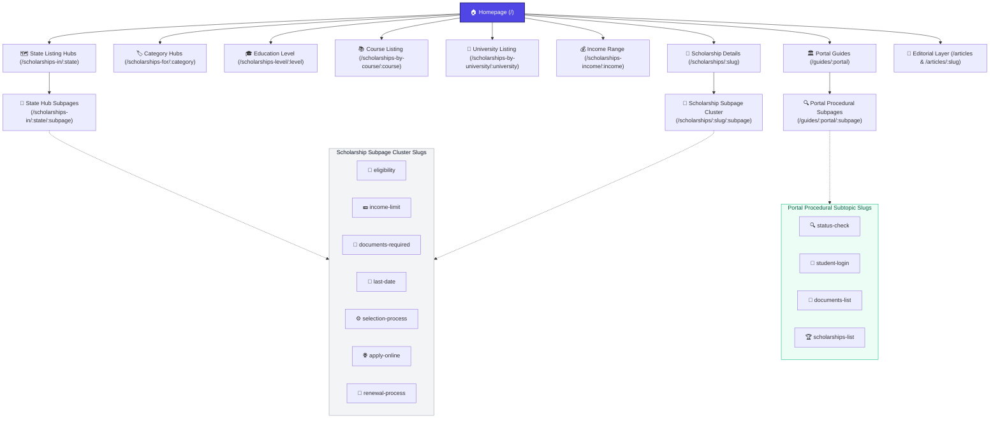

# IndiaScholarships Site Architecture & Programmatic SEO (pSEO) Strategy

This document details how the IndiaScholarships web platform is architected to optimize for search engine visibility, indexation, and capturing long-tail search queries. It is structured to serve as an integration resource for developers and AI agents.

---

## 🏗️ Architecture Overview

The site leverages **Next.js dynamic routing** coupled with a SQLite database containing scholarship opportunity details and dedicated portal metadata libraries (`lib/portalsData.ts`). Instead of relying solely on single detail pages per scholarship, the platform programmatically compiles **subpage clusters** targeting hyper-specific user intent (e.g., specific queries about deadlines, eligibility, documents, or application portals).

This multi-tiered hierarchy scales **214 base scholarships**, **10 master state/central portal guides**, and **30+ states/categories** into **over 26,800 indexable pages** with custom dynamic year headers (e.g., `2026`), structured JSON-LD schemas, and dedicated metadata.

---

## 📊 Visual Site Structure (Mermaid Diagram)

---

## ⚡ Programmatic SEO (pSEO) Matrix

By mapping the base database entries and portal data libraries into these programmatic templates, we cover key long-tail search permutations matching exact Google query patterns:

| Target Query Type (Long-Tail) | URL Route Pattern | SEO Purpose |
| :--- | :--- | :--- |
| **Direct Scholarship Information** | `/scholarships/:slug` | Standard target page for brand-level searches. |
| **Eligibility Queries** | `/scholarships/:slug/eligibility` | Captures *"Am I eligible for [Scholarship Name]?"* |
| **Income Cap Limits** | `/scholarships/:slug/income-limit` | Targets *"What is the family income limit for [Scholarship Name]?"* |
| **Required Documents Checklist** | `/scholarships/:slug/documents-required` | Targets *"[Scholarship Name] documents checklist list pdf"* |
| **Deadlines & Important Dates** | `/scholarships/:slug/last-date` | Targets *"When is the last date to apply for [Scholarship Name]?"* |
| **Selection Process / Rules** | `/scholarships/:slug/selection-process` | Targets *"How are candidates selected for [Scholarship Name]?"* |
| **Apply / Portal Registration** | `/scholarships/:slug/apply-online` | Targets *"How to apply online for [Scholarship Name] on portal"* |
| **Renewal Instructions** | `/scholarships/:slug/renewal-process` | Targets *"[Scholarship Name] renewal criteria and process"* |
| **State Listing Hubs** | `/scholarships-in/:state` | Captures broad *"scholarships in [State]"* |
| **State Hub Subpages** | `/scholarships-in/:state/:subpage` | Programmatic child pages at state level (for states with $\ge 3$ scholarships). |
| **Master Portal Guides** | `/guides/:portal` | Targets major state & central portal terms (*"e-Kalyan Jharkhand guide"*, *"NSP portal login"*). |
| **Portal Status Check Subpages** | `/guides/:portal/status-check` | Captures high-volume *"e kalyan status check 2026"*, *"PFMS payment tracking"*. |
| **Portal Student Login Subpages** | `/guides/:portal/student-login` | Captures *"e kalyan student login"*, *"portal registration step by step"*. |
| **Portal Documents Subpages** | `/guides/:portal/documents-list` | Captures *"e kalyan income affidavit format"*, *"portal document checklist"*. |
| **Portal Scholarships Subpages** | `/guides/:portal/scholarships-list` | Captures *"all scholarships hosted on e-kalyan portal"*. |
| **Editorial Main Index** | `/articles` | Primary listing hub with search and topic pill filters for Tier-2/3 simple English guides. |
| **Editorial Article Guides** | `/articles/:slug` | Captures top/mid-funnel procedural searches (*"how to fix bank seeding"*, *"is X scholarship safe"*). |

---

## 📰 Editorial Content Engine (`/articles`) Strategy

For the complete architectural blueprint, 100-article publishing calendar, Tier-2/3 simple English guidelines, and cannibalization defense protocols for the `/articles` section, see:
👉 [Master Editorial Strategy & Implementation Blueprint (EDITORIAL_ARTICLES_STRATEGY_IMPLEMENTATION.md)](file:///Users/roshankumar/Desktop/Schlarship%20Tracker%20/Scholarship-Tracker-POC-antigravity/scholarship-app/docs/EDITORIAL_ARTICLES_STRATEGY_IMPLEMENTATION.md)

---

## 🛠️ Multi-Sitemap Chunking Architecture (`app/sitemap.ts`)

To prevent single-sitemap file size and URL limit bottlenecks across 26,800+ static URLs, the sitemap engine utilizes Next.js `generateSitemaps()` to divide the sitemap index into 5 dedicated, topic-clustered XML feeds:

1. **`core` (`/sitemap/core.xml`)**: Homepage, primary category directories, static tools, master portal guides, and portal subpages.
2. **`scholarships` (`/sitemap/scholarships.xml`)**: Dynamic mapping of all primary scholarship detail pages (`/scholarships/${s.slug}`).
3. **`subpages` (`/sitemap/subpages.xml`)**: Cartesian product of all base scholarships and 7 subpage cluster routes (1,498+ URLs).
4. **`states` (`/sitemap/states.xml`)**: All state hubs and state subpages for states with $\ge 3$ active scholarships.
5. **`taxonomies` (`/sitemap/taxonomies.xml`)**: Category, education level, course, income range, level-x-country combinations, and university listing pages.

---

## ⚡ Priority Indexing Automation (`scripts/submit-indexing-api.js`)

To bypass standard sitemap discovery queues and accelerate Googlebot & Bingbot crawling:
* **IndexNow Protocol (`api.indexnow.org`)**: Pushes instant URL creation/update notifications to Bing & Yandex using key file `public/c0326e5e8e894b92b67f1b7454efb507.txt`.
* **Google Web Search Indexing API**: Batch submits top-tier/recently modified scholarship URLs directly to Googlebot using Google Service Account credentials (`scholarships-antigravity@...`).

---

## 🛡️ Anti-Thin Content & Conversion Guardrails

To maximize search engine ranking authority and user conversion:
* **Top Scholarships Card Grid Injection**: Every portal procedural subpage (`/status-check`, `/student-login`, `/documents-list`, `/scholarships-list`) embeds the **Top Scholarships Hosted on Portal** card grid to route procedural search traffic directly into money pages (`/scholarships/[slug]`).
* **Hero CTA & Off-Site Bounce Mitigation**: External portal links are located under the Helpdesk card in the right sidebar (never in the hero header) to prevent immediate off-site user bounce.
* **"Content Verification in Progress" Fallbacks**: Visual cards explain that specific details are under verification rather than leaving empty spaces or returning thin content.
* **Date Parsing & Fallbacks**: Non-parseable values like `"NA"` or `"Not specified"` display generic safe labels such as `"Open Now"` or `"Check Portal"` rather than `"Invalid Date"`.
* **Annual Amount Safe Chains**: To prevent displaying `₹0k` (which triggers alerts/poor CTR), the site runs a safe display check: `amount_annual` $\rightarrow$ `amount_min` $\rightarrow$ `"Amount Varies"`.
