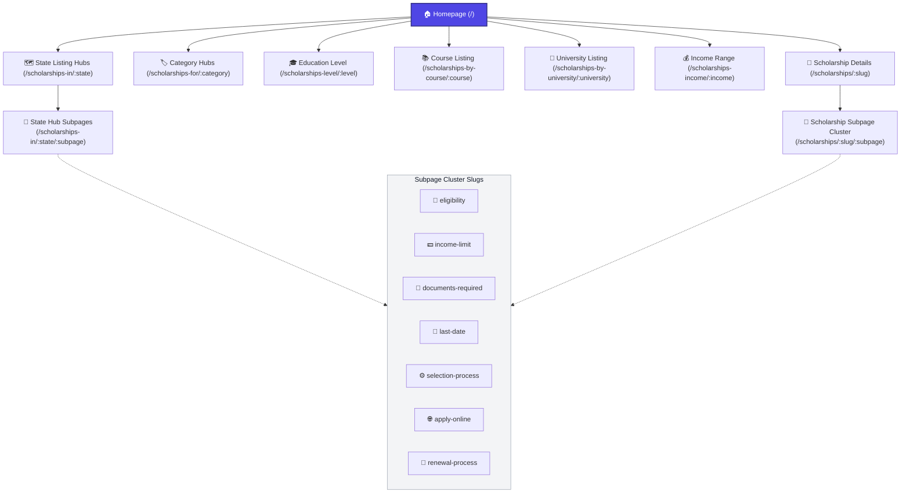

# IndiaScholarships Site Architecture & Programmatic SEO (pSEO) Strategy

This document details how the IndiaScholarships web platform is architected to optimize for search engine visibility, indexation, and capturing long-tail search queries. It is structured to serve as an integration resource for the Rozgaro agent.

---

## 🏗️ Architecture Overview

The site leverages **Next.js dynamic routing** coupled with a SQLite database containing scholarship opportunity details. Instead of relying solely on a single detail page per scholarship, the platform programmatically compiles **subpage clusters** targeting hyper-specific user intent (e.g., specific queries about deadlines, eligibility, documents, or application portals).

This multi-tiered hierarchy scales **214 base scholarships** and **30+ states/categories** into **over 1,800 indexable pages** with custom dynamic year headers (e.g., `2026`) and dedicated metadata.

---

## 📊 Visual Site Structure (Mermaid Diagram)

---

## ⚡ Programmatic SEO (pSEO) Matrix

By mapping the base database entries into these programmatic templates, we cover key long-tail search permutations that match exact Google query patterns:

| Target Query Type (Long-Tail) | URL Route Pattern | SEO Purpose |
| :--- | :--- | :--- |
| **Direct Scholarship Information** | `/scholarships/:slug` | Standard target page for brand-level searches. |
| **Eligibility Queries** | `/scholarships/:slug/eligibility` | Captures *"Am I eligible for [Scholarship Name]?"* |
| **Income cap limits** | `/scholarships/:slug/income-limit` | Targets *"What is the family income limit for [Scholarship Name]?"* |
| **Required Documents Checklist** | `/scholarships/:slug/documents-required` | Targets *"[Scholarship Name] documents checklist list pdf"* |
| **Deadlines & Important Dates** | `/scholarships/:slug/last-date` | Targets *"When is the last date to apply for [Scholarship Name]?"* |
| **Process / Step-by-Step guides** | `/scholarships/:slug/selection-process` | Targets *"How are candidates selected for [Scholarship Name]?"* |
| **Apply / Portals** | `/scholarships/:slug/apply-online` | Targets *"How to apply online for [Scholarship Name] on portal"* |
| **Renewals** | `/scholarships/:slug/renewal-process` | Targets *"[Scholarship Name] renewal criteria and process"* |
| **Geographic/State Hubs** | `/scholarships-in/:state` | Captures broad *"scholarships in [State]"* |
| **State Hub Subpages** | `/scholarships-in/:state/:subpage` | Programmatic child pages at state-level. |

---

## 🛠️ Dynamic Sitemap Generation (`app/sitemap.ts`)

To ensure Google crawls and indexes all programmatic variations, the dynamic sitemap generation code parses the SQLite database and compiles routes for all permutations:

1. **Static Routes**: Main category directories, tools, and guides.
2. **Scholarship Details**: Dynamic mapping of each database record (`/scholarships/${s.slug}`).
3. **State Listing & Subpages**: Loops through all states (e.g., `/scholarships-in/odisha/last-date`).
4. **Category, Education Level, Income, Course, and University Listings**: Directory pages dynamically mapping entries.
5. **Scholarship Subpage Cluster**: Cartesion product of all database records and the 7 cluster subpages:
   $$\text{Scholarships (214)} \times \text{Subpage Clusters (7)} = 1,498 \text{ dynamically generated child URLs}$$

---

## 🛡️ Anti-Thin Content Guardrails

To prevent search engines from penalizing the site for "thin content" when some database fields are empty or verification is ongoing:
* **"Content Verification in Progress" fallbacks**: Elegant visual cards explain that the information is currently being verified rather than returning empty spaces or generic templates.
* **Date Parsing & Fallbacks**: The templates dynamically check for non-parseable values like `"NA"` or `"Not specified"` and display generic labels such as `"Open Now"` or `"Check Portal"` rather than `"Invalid Date"`.
* **Annual Amount Safe Chains**: To prevent displaying `₹0k` (which triggers alerts/poor CTR), the site runs a safe display check: `amount_annual` $\rightarrow$ `amount_min` $\rightarrow$ `"Amount Varies"`.
