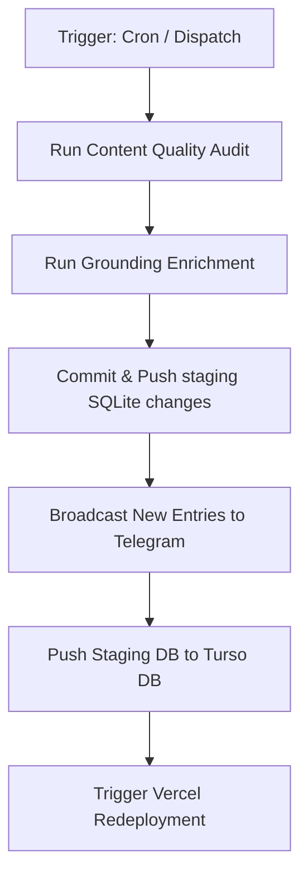

# Weekly Scholarship Data Enrichment Pipeline Handbook

This document records the architecture, automation steps, operational scripts, and secret requirements for the automated Weekly Scholarship Data Enrichment pipeline running on IndiaScholarships.in.

---

## 1. Pipeline Overview
The pipeline is designed to automate the ingestion, enrichment, quality verification, and deployment of scholarship data on a weekly schedule.

* **Trigger Schedule**: Automated cron at `0 0 * * 0` (every Sunday at midnight UTC).
* **Manual Trigger**: Supports manual runs via the **Workflow Dispatch** interface on the GitHub Actions tab.
* **Workflow Configuration**: Configured in [weekly-enrichment.yml](file:///Users/roshankumar/Desktop/Schlarship%20Tracker%20/Scholarship-Tracker-POC-antigravity/.github/workflows/weekly-enrichment.yml).

---

## 2. In-Depth Step Workflow

1. **Checkout & Environment Setup**: The action checks out the repository and initializes a Node.js v24 environment.
2. **Run Content Quality Audit**: 
   * Runs `node scholarship-app/scripts/content-quality-audit.js`.
   * *Strict Mode (`--strict`)* is enforced only during pull requests or direct commits to prevent invalid database updates. During scheduled weekly runs or manual dispatches, formatting failures are logged as warnings without halting the workflow.
3. **Run Grounding Enrichment**:
   * Runs `node scholarship-app/scripts/enrich-all-low-ctr-gemini.js --limit 50`.
   * Queries Google Search Console data to identify the top 50 low-CTR or high-traffic pages, queries Gemini Grounding/Perplexity API to fetch the latest scholarship details, and updates the local staging SQLite database (`scholarships.db`).
4. **Commit & Push Changes**:
   * Commits the updated local SQLite database (`scholarships.db`) and quality reports (`content-quality-report.md`) back to the `main` branch.
   * Requires the workflow to have `permissions: contents: write`.
5. **Broadcast New Entries to Telegram**:
   * Runs `node scholarship-app/scripts/post-new-to-telegram.js`.
   * Scans the database for newly active/verified scholarships and posts highlights digests to the Telegram channel.
6. **Push Database to Turso**:
   * Runs `node scholarship-app/scripts/push-to-turso.js`.
   * Uploads the local SQLite staging database updates to the live production Turso Database.
7. **Trigger Vercel Redeployment**:
   * Submits a POST request to the Vercel Deploy Hook to rebuild and clear cache on the live website.

---

## 3. GitHub Actions Environment Configuration (Secrets)
For the pipeline to execute successfully, the following repository secrets must be configured under **Settings** $\rightarrow$ **Secrets and variables** $\rightarrow$ **Actions**:

| Secret Name | Purpose | Example / Format |
| :--- | :--- | :--- |
| `GEMINI_API_KEY` | API authentication for fetching data from Gemini model grounding | `AIzaSy...` |
| `PERPLEXITY_API_KEY` | Backup search API authentication | `pplx-...` |
| `TELEGRAM_BOT_TOKEN` | Bot identity token created by BotFather | `8985546274:AAHyq...` |
| `TELEGRAM_CHANNEL_ID` | Targeted channel ID for posting announcements | `-1003701678321` |
| `TURSO_DATABASE_URL` | Live cloud database location | `libsql://...turso.io` |
| `TURSO_AUTH_TOKEN` | Turso connection token | `eyJhbGci...` |
| `VERCEL_DEPLOY_HOOK` | Vercel production rebuild trigger hook | `https://api.vercel.com/v1/integrations/deploy/...` |

---

## 4. Operation Guide

### A. How to trigger a manual audit/enrichment run:
1. Go to the GitHub repository page.
2. Navigate to the **Actions** tab.
3. Select the **Weekly Scholarship Data Enrichment** workflow from the sidebar.
4. Click the **Run workflow** dropdown, choose the `main` branch, and click **Run workflow**.

### B. Troubleshooting:
* **Failure at Audit Step**: If the run is triggered by a git push (or pull request), strict mode is enforced. If the run fails, check `data/content-quality-report.md` for invalid entries and fix them.
* **Skip Telegram Broadcasts**: If Telegram keys are missing or invalid, the script will log a warning and skip the step gracefully without breaking the rest of the workflow.
